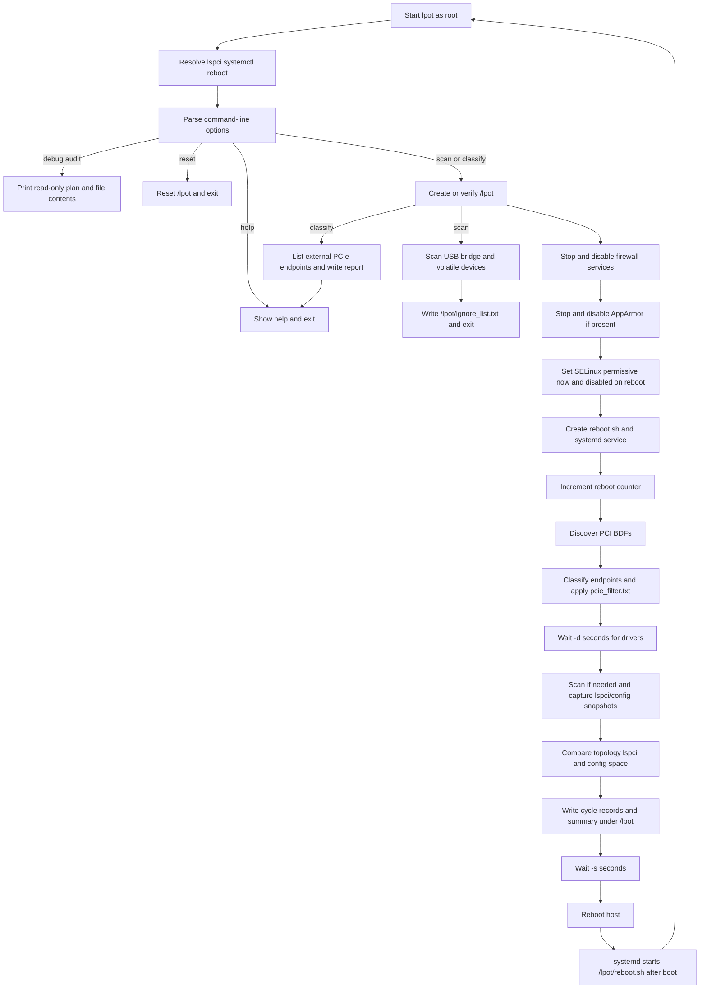

# LPOT

LPOT is a Go implementation of a Linux PCIe reboot-stability test tool. It
combines the original LPOT, `configscan`, and `lpotscan` workflow into one
executable and is maintained as an integrated version of
[Nephom/lpot](https://github.com/Nephom/lpot).

The tool records PCI topology, `lspci` output, and PCI configuration-space
changes across reboot cycles. PCIe link classification is reported as separate
evidence, while raw configuration sampling retains devices so a capability
decode mismatch cannot hide changed byte offsets. Explicit per-device
overrides remain available.

## Warning

This is a system-level test tool, not a desktop utility. A normal run requires
root on a Linux host and can reboot that host repeatedly. It accesses
`/sys/bus/pci`, writes under `/lpot`, stops/disables firewall services,
stops/disables AppArmor when present, changes the SELinux configuration when
present, installs `lpot.service`, and invokes `reboot` unless audit mode is
enabled. Use it only on a disposable or explicitly reserved test system.

## Features

- Repeated reboot testing for a configurable duration.
- PCI device topology and `lspci -vv` comparison between cycles.
- Raw PCI configuration-space hex dumps for KEEP devices are available from the
  local dashboard for manual review of decoded PCIe link fields.
- PCI configuration-space scanning with volatile-byte filtering.
- Endpoint classification with an optional `/lpot/pcie_filter.txt` override.
- Interruptible waits and bounded external-command execution.
- Local read-only result dashboard (`-ui`) backed by an aggregated JSON report.
- Root-owned runtime directory (`0755`) for readable reports, with
  root-only reboot controls and symlink-resistant writes.
- Per-cycle logs and a final summary that separates noteworthy changes from
  recurring configuration noise.
- Optional user command execution on every boot, with combined output in
  `/lpot/command_user_custom.log`.

## Requirements

- Linux with root access.
- Go 1.19 or newer for building.
- `lspci` from the `pciutils` package.
- `systemd` for reboot persistence during a normal run.
- A root-owned lab host where firewall, SELinux, and AppArmor can be disabled.
- A test host whose reboot can be interrupted or observed safely.

The project targets Linux only. macOS may be used as the local development
environment, but it must produce a Linux binary through cross-compilation.

## Linux Build

```bash
BUILD_TIME="$(date -u +%Y-%m-%dT%H:%M:%SZ)"
GOOS=linux GOARCH=amd64 go build -trimpath \
  -ldflags="-s -w -X main.buildTime=${BUILD_TIME}" -o lpot .
```

The command above can be run from macOS or another development host. The
resulting executable depends on Linux sysfs, PCI utilities, systemd, and
root-only operations, so it must be deployed and run on Linux.

No unit-test suite is maintained for this system-level executable. The required
local verification is a successful Linux-target compilation. Optional static
analysis can be run in a compatible Go environment with:

```bash
go vet ./...
BUILD_TIME="$(date -u +%Y-%m-%dT%H:%M:%SZ)"
go build -trimpath -ldflags="-s -w -X main.buildTime=${BUILD_TIME}" -o lpot .
```

Install the resulting binary on a Linux test host as appropriate for your
environment. The default `.gitignore` excludes generated reports and artifacts.

## Usage

An invocation without `-t` only displays the help menu. This prevents an
accidental reboot test when a downloaded binary is run without arguments. The
bare `-t` form uses the default duration of 12 hours; otherwise pass an
explicit duration such as `-t 24`.

Always inspect the help output from the exact binary being tested:

```bash
sudo ./lpot -h
```

The first normal invocation can come from any stable location. LPOT copies the
running executable to `/lpot/lpot` and writes `/lpot/reboot.sh` to execute that
fixed path after reboot. The original downloaded file can be replaced or
removed only after the test has stopped; updating the test binary requires
running the new binary with `-t` again.

Common commands:

```bash
# List external PCIe endpoints and write the classification report.
sudo ./lpot -classify

# Scan USB/bridge/volatile devices and write /lpot/ignore_list.txt.
sudo ./lpot -scan

# Open the completed result report in the local browser.
./lpot -ui

# First invocation: install the binary persistently and run for twenty-four
# hours, waiting 600 seconds before each reboot.
sudo -i
cd /root
./lpot -t 24 -s 600

# Stop after a detected comparison error.
sudo ./lpot -p

# Run a long-lived command in the background on every boot. LPOT options must
# appear before -c; every argument after -c belongs to the user command.
sudo ./lpot -t 24 -c /usr/bin/ping -t 192.168.1.1

# Reset the runtime directory. Review the target host before using this.
sudo ./lpot -r
```

## Runtime Flow

The normal execution path is shown below. The same binary is restarted by
systemd after each reboot, so the cycle returns to startup until the timestamp
expires or the operator stops it.



## Host Policy Preparation

On normal runs the program performs distribution-aware host preparation.
Missing services are expected and do not abort the run; an installed service
that cannot be stopped/disabled aborts the run before the reboot service is
created:

- RHEL: `firewalld`, `nftables`, `iptables`, and SELinux are handled when
  installed.
- SLES: `firewalld`, `nftables`, `iptables`, and legacy `SuSEfirewall2` are
  handled when installed; SELinux is handled if installed.
- Ubuntu: `ufw`, `nftables`, `iptables`, and AppArmor are handled when
  installed; SELinux is handled if installed.

Firewall units are stopped and disabled. `ufw disable` is also invoked when
available. AppArmor is stopped and disabled when its service exists. SELinux is
set to permissive for the current boot and `SELINUX=disabled` is written to
`/etc/selinux/config` for subsequent boots. This behavior is intended only for
dedicated laboratory machines.

Options:

| Option | Meaning | Default |
| --- | --- | --- |
| `-t hours` | Test duration in hours | `12` |
| `-tm count` | Reboot exactly this many times; `count + 1` cycles are recorded | disabled |
| `-d seconds` | Driver/device preparation delay | `300` |
| `-s seconds` | Delay before reboot | `300` |
| `-p` | Stop when an error is detected | disabled |
| `-c command ...` | Run the command and all following arguments in the background on every boot; append stdout and stderr to `/lpot/command_user_custom.log` | disabled |
| `-r` | Reset `/lpot` runtime state | off |
| `-scan` | Generate volatile-byte ignore data and exit | off |
| `-classify` | Print endpoint classification and exit | off |
| `-ui` | Open the local read-only result dashboard | off |
| `-h` | Show help | off |

## Endpoint Filter

Create `/lpot/pcie_filter.txt` on the test host when the automatic endpoint
classification needs an exception. Blank lines and lines beginning with `#`
are ignored.

```text
# Force an endpoint to be included
+ 21:00.0

# Force a device to be excluded
- 03:00.0

# A bare BDF is treated as an include override
0000:04:00.0
```

Both short (`21:00.0`) and long (`0000:21:00.0`) BDF forms are accepted.
Exclusions take precedence over inclusions. Run `-classify` first to review
the resulting decisions before starting a reboot test.

## Runtime Files

The program stores persistent state under `/lpot`:

- `lpot`: installed executable used by systemd after reboot.
- `reboot.log`: per-cycle events and final summary.
- `rebootcount`: current reboot-cycle counter.
- `timestamp`: test expiration timestamp.
- `tm_target` / `tm_start_count`: `-tm` reboot-limit target and start cycle,
  written for fixed-count runs and removed when the limit completes.
- `initial_pci_devices.txt`: initial `lspci` snapshot.
- `ignore_list.txt`: explicit whole-device ignores for USB controllers plus
  volatile offsets. PCIe capability decode failures do not remove a device
  from raw config comparison.
- `lpotscan.log`: lspci comparison log, one compact `<BDF> | <field> changed |
  before: ... | after: ...` line per changed Dev/Lnk capability field,
  accumulated for the entire run (not truncated between cycles).
- `pci-config-changes.log`: configuration-space comparison results, diffed
  against the one-time `/lpot/initial.bin` baseline on every cycle.
  `initial.bin` is rebased in place whenever a NEW/REMOVED topology event is
  logged, so the same event is reported once, not every subsequent cycle.
- `config_dump/<bdf>_baseline.txt`: the first-cycle raw PCI configuration
  bytes for each KEEP device, captured once and never overwritten.
- `config_dump/<bdf>_latest.txt`: the current cycle's raw PCI configuration
  bytes for each KEEP device, refreshed every cycle. The dashboard (`-ui`)
  exposes both so a user can compare the initial and current snapshot for the
  same device.
- `pci_devices_classify.log`: historical `-classify` reports.
- `pcie_filter.txt`: optional endpoint overrides.
- `tmp/`: temporary per-device `lspci` snapshots. `<bdf>_init.txt` is rebased
  in place whenever a Dev/Lnk field change or topology event is logged for
  that device, for the same "report once" reason as `initial.bin`.
- `change_log.jsonl` / `test_stats.json`: whole-run persisted event log and
  counters that back the final summary's "Affected Cycles", "Most affected
  device", and "Most changed field" sections across the brand-new process
  each reboot cycle runs in.
- `result.json`: atomic structured checkpoint and final test report.
- `command_user_custom.log`: stdout and stderr from the optional background
  command configured with `-c`.

`/lpot` and `/lpot/tmp` are root-owned and mode `0755` so non-root operators
can inspect reports. The reboot executable and script remain root-owned and
mode `0700`; only root can modify reboot behavior.

The `logs/` directory in this repository is intentionally ignored because
runtime logs can contain host-specific hardware information.

## Result Dashboard

After a normal test has produced `/lpot/result.json`, open the local read-only
dashboard on the test machine with:

```bash
./lpot -ui
```

The dashboard binds only to `127.0.0.1`, opens Firefox when available, and
shows the overall status, check categories,
cycle timeline, filtered problems, and links to detailed text logs. The PCIe
Link Evidence table has a filter toolbar (KEEP devices only / all devices /
changed devices only, defaulting to KEEP only so a large system doesn't render
a wall of SKIP rows) and, per KEEP device, separate "Baseline" and "Latest"
links to that device's raw config-space dump so the initial and current state
can be compared directly. A checkpoint is written after each completed cycle
before the reboot wait starts; the final report is written when the test
expires. The dashboard does not modify `/lpot`, systemd, security policy, or
reboot state.

## Offline Simulation (Development Only)

A `simulate`-tagged build exercises the real comparison/reporting pipeline
(`classifyDevices`, `runConfigScan`, `processPCIDevices`,
`generateFinalSummary`, `writeResultReport`) against a synthetic 10-cycle
reboot run, entirely offline — no root, no systemd, no real PCI hardware,
and no actual reboot:

```bash
go build -tags simulate -o /tmp/lpot-sim .
/tmp/lpot-sim -out ./test
```

This writes a full simulated `/lpot`-shaped tree under `./test/lpot`
(`reboot.log`, `lpotscan.log`, `pci-config-changes.log`, `result.json`, ...),
a `./test/VERIFICATION_TRACKING.md` table recording exactly what was
injected each cycle, what the logs were expected to show, and whether that
expectation held (PASS/FAIL) against the real output, and a
`./test/dashboard.html` snapshot of the same `-ui` dashboard pre-loaded with
the simulated result so it can be opened directly in a browser. `./test/` is
gitignored and must never be committed.

## Review Notes and Known Limitations

The implementation targets Linux. Confirm the Linux-target build succeeds
before deployment, then validate the full reboot workflow on the intended Linux
hardware. The macOS role is limited to local development and cross-compilation;
the binary must not be run there.

Technical documentation is organized under [`docs/`](docs/README.md). Ongoing
changes, known parser limitations, security history, and the planned remote
host/report/dashboard management layer are tracked in
[GitHub Issues](https://github.com/Nephom/lpot/issues).

## License and Relationship to Upstream

This project retains the upstream repository's GPL-3.0 license. See
[`LICENSE`](LICENSE). It is an integrated and modified version of the LPOT
project, not a drop-in replacement for an upstream release. Changes and
integration-specific behavior should be documented when extending the tool.
