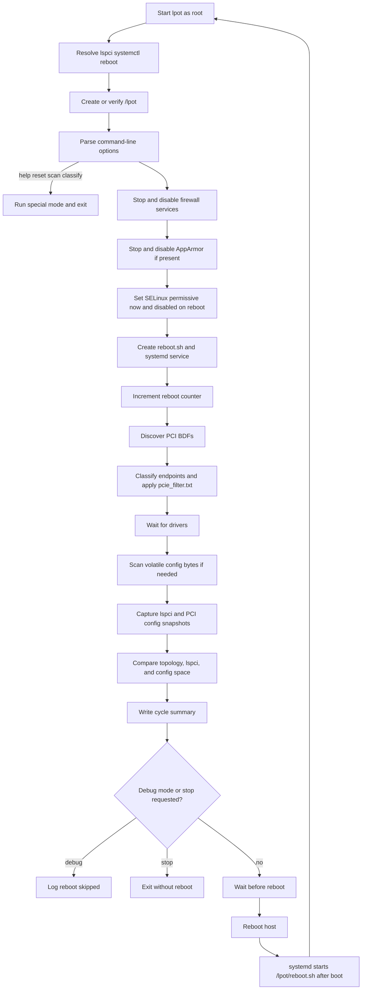

# LPOT

LPOT is a Go implementation of a Linux PCIe reboot-stability test tool. It
combines the original LPOT, `configscan`, and `lpotscan` workflow into one
executable and is maintained as an integrated version of
[Nephom/lpot](https://github.com/Nephom/lpot).

The tool records PCI topology, `lspci` output, and PCI configuration-space
changes across reboot cycles. It classifies PCIe endpoints so that bridges and
other non-endpoint devices do not create misleading failures, while allowing
explicit per-device overrides.

## Warning

This is a system-level test tool, not a desktop utility. A normal run requires
root on a Linux host and can reboot that host repeatedly. It accesses
`/sys/bus/pci`, writes under `/lpot`, stops/disables firewall services,
stops/disables AppArmor when present, changes the SELinux configuration when
present, installs a systemd service, and invokes `reboot` unless debug mode is
enabled. Use it only on a disposable or explicitly reserved test system.

## Features

- Repeated reboot testing for a configurable duration.
- PCI device topology and `lspci -vv` comparison between cycles.
- PCI configuration-space scanning with volatile-byte filtering.
- Endpoint classification with an optional `/lpot/pcie_filter.txt` override.
- Interruptible waits and bounded external-command execution.
- Root-owned, permission-restricted runtime directory and symlink-resistant
  writes for persistent files.
- Per-cycle logs and a final summary that separates noteworthy changes from
  recurring configuration noise.

## Requirements

- Linux with root access.
- Go 1.19 or newer for building.
- `lspci` from the `pciutils` package.
- `systemd` for reboot persistence during a normal run.
- A root-owned lab host where firewall, SELinux, and AppArmor can be disabled.
- A test host whose reboot can be interrupted or observed safely.

The project targets Linux only. macOS may be used as the local development
environment, but it must produce a Linux binary through cross-compilation.

## Linux Build

```bash
GOOS=linux GOARCH=amd64 go build -o lpot .
```

The command above can be run from macOS or another development host. The
resulting executable depends on Linux sysfs, PCI utilities, systemd, and
root-only operations, so it must be deployed and run on Linux.

No unit-test suite is maintained for this system-level executable. The required
local verification is a successful Linux-target compilation. Optional static
analysis can be run in a compatible Go environment with:

```bash
go vet ./...
go build -o lpot .
```

Install the resulting binary on a Linux test host as appropriate for your
environment. The default `.gitignore` excludes generated reports and artifacts.

## Usage

Always inspect the help output from the exact binary being tested:

```bash
sudo ./lpot -h
```

Common commands:

```bash
# Dry-run endpoint classification; does not start a reboot test.
sudo ./lpot -classify

# Generate the volatile PCI configuration-byte ignore list and exit.
sudo ./lpot -scan

# Two-hour debug run; debug mode does not invoke reboot.
sudo ./lpot -g -t 2

# Twenty-four hours, waiting 600 seconds before each reboot.
sudo ./lpot -t 24 -s 600

# Stop after a detected comparison error.
sudo ./lpot -p

# Reset the runtime directory. Review the target host before using this.
sudo ./lpot -r
```

## Runtime Flow

The normal execution path is shown below. The same binary is restarted by
systemd after each reboot, so the cycle returns to startup until the timestamp
expires or the operator stops it.



## Host Policy Preparation

On normal runs the program performs distribution-aware host preparation.
Missing services are expected and do not abort the run; an installed service
that cannot be stopped/disabled aborts the run before the reboot service is
created:

- RHEL: `firewalld`, `nftables`, `iptables`, and SELinux are handled when
  installed.
- SLES: `firewalld`, `nftables`, `iptables`, and legacy `SuSEfirewall2` are
  handled when installed; SELinux is handled if installed.
- Ubuntu: `ufw`, `nftables`, `iptables`, and AppArmor are handled when
  installed; SELinux is handled if installed.

Firewall units are stopped and disabled. `ufw disable` is also invoked when
available. AppArmor is stopped and disabled when its service exists. SELinux is
set to permissive for the current boot and `SELINUX=disabled` is written to
`/etc/selinux/config` for subsequent boots. This behavior is intended only for
dedicated laboratory machines.

Options:

| Option | Meaning | Default |
| --- | --- | --- |
| `-t hours` | Test duration in hours | `12` |
| `-d seconds` | Driver/device preparation delay | `300` |
| `-s seconds` | Delay before reboot | `300` |
| `-p` | Stop when an error is detected | disabled |
| `-g` | Debug mode; do not reboot | disabled |
| `-r` | Reset `/lpot` runtime state | off |
| `-scan` | Generate volatile-byte ignore data and exit | off |
| `-classify` | Print endpoint classification and exit | off |
| `-h` | Show help | off |

## Endpoint Filter

Create `/lpot/pcie_filter.txt` on the test host when the automatic endpoint
classification needs an exception. Blank lines and lines beginning with `#`
are ignored.

```text
# Force an endpoint to be included
+ 21:00.0

# Force a device to be excluded
- 03:00.0

# A bare BDF is treated as an include override
0000:04:00.0
```

Both short (`21:00.0`) and long (`0000:21:00.0`) BDF forms are accepted.
Exclusions take precedence over inclusions. Run `-classify` first to review
the resulting decisions before starting a reboot test.

## Runtime Files

The program stores persistent state under `/lpot`:

- `reboot.log`: per-cycle events and final summary.
- `rebootcount`: current reboot-cycle counter.
- `timestamp`: test expiration timestamp.
- `initial_pci_devices.txt`: initial `lspci` snapshot.
- `ignore_bits.txt`: configuration bytes treated as volatile.
- `pci-config-changes.log`: configuration-space comparison results.
- `pci_devices_classify.log`: historical `-classify` reports.
- `pcie_filter.txt`: optional endpoint overrides.
- `tmp/`: temporary per-device `lspci` snapshots.

The `logs/` directory in this repository is intentionally ignored because
runtime logs can contain host-specific hardware information.

## Review Notes and Known Limitations

The implementation targets Linux. Confirm the Linux-target build succeeds
before deployment, then validate the full reboot workflow on the intended Linux
hardware. The macOS role is limited to local development and cross-compilation;
the binary must not be run there.

Technical documentation is organized under [`docs/`](docs/README.md). Ongoing
changes, known parser limitations, security history, and the planned remote
host/report/dashboard management layer are tracked in
[GitHub Issues](https://github.com/Nephom/lpot/issues).

## License and Relationship to Upstream

This project retains the upstream repository's GPL-3.0 license. See
[`LICENSE`](LICENSE). It is an integrated and modified version of the LPOT
project, not a drop-in replacement for an upstream release. Changes and
integration-specific behavior should be documented when extending the tool.
