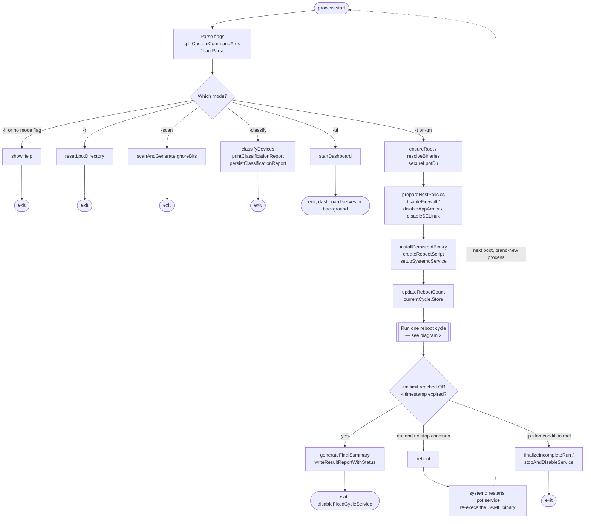
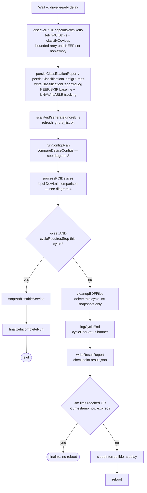
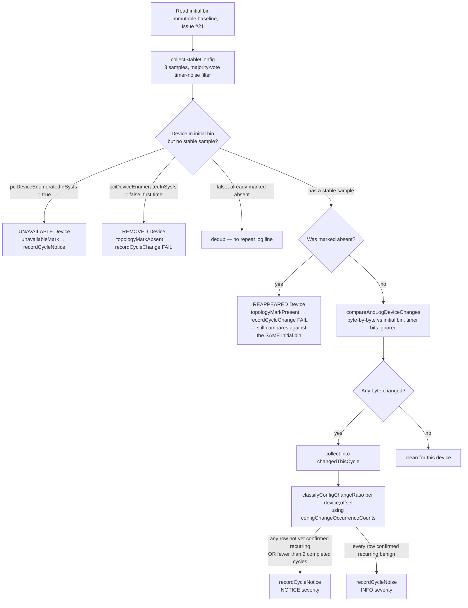
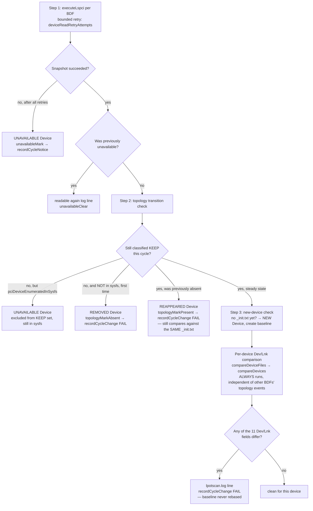

# Function Call Graph

This document is a GitHub-style code-navigation reference: every function
declared in this repository, one line describing what it does, which
functions call it (**Called by**), and which functions it calls (**Calls**).

It is generated from a Go AST scan of the actual source (not written by
hand), so "Called by" and "Calls" reflect the real call graph at the time of
generation, not a description that can silently drift from the code. If you
add, rename, or remove a function, regenerate this file rather than
hand-editing the call lists.

**How to regenerate:** walk every top-level `.go` file (excluding
`*_test.go`) with `go/parser`/`go/ast`, collect every `*ast.FuncDecl`
(recording its file, line, doc comment, and rendered signature), then walk
each function body with `ast.Inspect` to record every `*ast.CallExpr` whose
callee name matches another collected function — that gives the **Calls**
edges directly and the **Calls** edges' inverse gives **Called by**. No
generation script is checked into this repository (it is a one-off
documentation tool, not part of the shipped binary or its module graph);
re-implementing the walk above from scratch takes only a small standalone
`package main` using the standard library.

Every function below has at least one caller except `main` (the process
entry point) — there is no dead code in this repository at the time of
generation.

For the end-to-end flow (startup → cycle → comparison → reboot) see the
[Flow Diagrams](#flow-diagrams) section at the end of this document, and
[`architecture.md`](architecture.md) for the file-level responsibility
breakdown.

---

## Table of Contents

- [`cli.go`](#cligo)
- [`cli_main.go`](#cli_maingo)
- [`bdf.go`](#bdfgo)
- [`lifecycle.go`](#lifecyclego)
- [`logging.go`](#logginggo)
- [`runtime.go`](#runtimego)
- [`systemd.go`](#systemdgo)
- [`pcie_classify.go`](#pcie_classifygo)
- [`pci_config_scan.go`](#pci_config_scango)
- [`lspci_compare.go`](#lspci_comparego)
- [`device_state.go`](#device_statego)
- [`reboot_cycle.go`](#reboot_cyclego)
- [`summary.go`](#summarygo)
- [`result_helpers.go`](#result_helpersgo)
- [`dashboard.go`](#dashboardgo)
- [Flow Diagrams](#flow-diagrams)

---

## cli.go

### `splitCustomCommandArgs`
*cli.go:11*

```go
func splitCustomCommandArgs(args []string) ([]string, []string, error)
```

splitCustomCommandArgs removes -c and treats every following token as the
custom command argv. LPOT flags must therefore appear before -c.

**Called by:** `main`

**Calls:** *(none — leaf function)*

### `flagWasProvided`
*cli.go:35*

```go
func flagWasProvided(name string) bool
```

*(no doc comment; see source)*

**Called by:** `main`

**Calls:** *(none — leaf function)*

### `applyDefaultDurationForBareT`
*cli.go:47*

```go
func applyDefaultDurationForBareT()
```

*(no doc comment; see source)*

**Called by:** `main`

**Calls:** *(none — leaf function)*

### `showHelp`
*cli.go:59*

```go
func showHelp(programName string)
```

Show help

**Called by:** `main`

**Calls:** *(none — leaf function)*

## cli_main.go

### `main`
*cli_main.go:21*

```go
func main()
```

main is the process entry point for every LPOT mode: -h/-r/-scan/-classify/-ui
(each returns early without entering the reboot-cycle path), and the normal
-t/-tm reboot-test path, which runs exactly one cycle (PCI discovery,
classification, raw config-space scan, lspci Dev/Lnk comparison, result
checkpoint) then either reboots and lets systemd re-exec this same binary
for the next cycle, or finalizes the run when the cycle/time limit or a
stop condition is reached. See architecture.md's "Startup Flow" and
"Reboot Cycle" sections for the full sequence this function implements.

**Called by:** *(entry point — not called from within this codebase)*

**Calls:** `applyDefaultDurationForBareT`, `buildClassificationReport`, `classifyDevices`, `cleanupBDFFiles`, `createRebootScript`, `cycleChangeKind`, `cycleEndStatus`, `cycleRequiresStop`, `cycleTag`, `disableFixedCycleService`, `discoverPCIEndpointsWithRetry`, `ensureRoot`, `executeLspci`, `fatalOperation`, `fetchPCIBDFs`, `fileExists`, `filterClassifiedEndpoints`, `finalizeIncompleteRun`, `fixedCycleLimitReached`, `flagWasProvided`, `generateFinalSummary`, `getCurrentTimestamp`, `loadPCIeFilterOverrides`, `logCycleEnd`, `logInitialInfo`, `logWarn`, `normalizeBDF`, `openSecureAppend`, `persistClassificationConfigDumps`, `persistClassificationReport`, `persistentRebootArgs`, `prepareHostPolicies`, `prepareTestCycleLimit`, `printClassificationReport`, `processPCIDevices`, `readSysfsConfig`, `readTimestamp`, `resetClassificationBaseline`, `resetLpotDirectory`, `resolveBinaries`, `runConfigScan`, `runExternal`, `scanAndGenerateIgnoreBits`, `secureLpotDir`, `setupSignalHandlers`, `setupSystemdService`, `showHelp`, `sleepInterruptible`, `splitCustomCommandArgs`, `startDashboard`, `stopAndDisableService`, `updateRebootCount`, `validateInputParameters`, `writeClassificationReportToLog`, `writeFileNoFollow`, `writeResultReport`, `writeTimestamp`

### `finalizeIncompleteRun`
*cli_main.go:578*

```go
func finalizeIncompleteRun()
```

finalizeIncompleteRun writes both the human-readable final summary and the
machine-readable INCOMPLETE result for every interrupted run path.

**Called by:** `main`

**Calls:** `generateFinalSummary`

### `discoverPCIEndpointsWithRetry`
*cli_main.go:598*

```go
func discoverPCIEndpointsWithRetry(fetch func() ([]string, error), classify func([]string) ([]string, []deviceClassification), maxAttempts int, interval time.Duration, shouldStop func() bool) (pciDiscoveryResult, error)
```

discoverPCIEndpointsWithRetry waits for PCI enumeration to become visible by
re-reading sysfs on every attempt. It retries only a bounded number of times;
an empty KEEP set is a valid final result and is not converted into fake
success. fetch and classify are injected so the retry state machine can be
tested without requiring Linux PCI hardware.

**Called by:** `main`

**Calls:** `filterClassifiedEndpoints`

## bdf.go

### `normalizeBDF`
*bdf.go:27*

```go
func normalizeBDF(bdf string) string
```

normalizeBDF returns the short form ("bus:device.function") of a BDF when
the long form has domain 0000, and the input unchanged otherwise. This
unifies map keys across the sysfs world (always long) and the lspci-text
world (always short) on single-domain systems while preserving correctness
on the very rare multi-domain host.

**Called by:** `buildResultReport`, `classifyDevices`, `compareDeviceConfigs`, `compareDeviceFiles`, `configChangeOccurrenceCounts`, `configDumpPath`, `detectVolatileBytesWithSamples`, `endpointFilterAllows`, `filterClassifiedEndpoints`, `generateConfigSpaceSummary`, `loadIgnoreList`, `loadPCIeFilterOverrides`, `main`, `processPCIDevices`, `readIgnoreDevicesAndOffsets`, `recordDeviceFieldChanges`, `saveIgnoreBits`, `savePCIConfigReportingFailures`, `splitDevices`

**Calls:** *(none — leaf function)*

## lifecycle.go

### `runExternal`
*lifecycle.go:21*

```go
func runExternal(timeout time.Duration, name string, args ...string) ([]byte, error)
```

runExternal runs an external command with an upper-bound timeout derived
from rootCtx, so both Ctrl-C and a stuck child will release the caller.
argv[0] must be an absolute path or be resolvable via exec.LookPath; callers
are responsible for passing a trusted command name.

**Called by:** `disableFirewall`, `disableFixedCycleService`, `disableSELinux`, `enrichLspciLinkInfo`, `executeLspci`, `main`, `resetLpotDirectory`, `setupSystemdService`, `stopAndDisableService`, `stopAndDisableUnit`, `systemdDefaultTarget`, `systemdUnitExists`

**Calls:** `logWarn`

### `isTrustedBinPath`
*lifecycle.go:56*

```go
func isTrustedBinPath(p string) bool
```

isTrustedBinPath reports whether p lives under one of trustedBinDirs.

**Called by:** `resolveBinaries`

**Calls:** *(none — leaf function)*

### `resolveBinaries`
*lifecycle.go:68*

```go
func resolveBinaries(requireLSPCITools, requireRebootTools bool) error
```

resolveBinaries locks down PATH and resolves the external tools the test
harness will invoke. It must run before setupSystemdService() or any loop
that shells out.

**Called by:** `main`

**Calls:** `isTrustedBinPath`

### `ensureRoot`
*lifecycle.go:130*

```go
func ensureRoot()
```

ensureRoot aborts startup if the process is not running with effective uid 0.
Every meaningful operation (reading PCI config space, writing to /etc, and
rebooting the host) requires root, so refusing early is clearer than failing
later with a partially-initialised state.

**Called by:** `main`

**Calls:** *(none — leaf function)*

### `secureLpotDir`
*lifecycle.go:141*

```go
func secureLpotDir() error
```

secureLpotDir ensures LPOT_DIR exists as a real directory owned by root and
not reachable through a symlink. The directory is readable/traversable by
non-root users for operational inspection, while files that control reboot
execution remain root-owned and non-writable by other users.

**Called by:** `main`

**Calls:** *(none — leaf function)*

### `sleepInterruptible`
*lifecycle.go:194*

```go
func sleepInterruptible(ctx context.Context, d time.Duration) bool
```

sleepInterruptible blocks until d elapses or ctx is cancelled. It returns
true if the full duration elapsed and false if the context was cancelled
first. Callers that must not proceed after cancellation should consult the
return value (or stopFlag) before taking their next action.

**Called by:** `main`, `processPCIDevices`

**Calls:** *(none — leaf function)*

### `setupSignalHandlers`
*lifecycle.go:211*

```go
func setupSignalHandlers()
```

setupSignalHandlers installs SIGINT/SIGTERM handling. The first signal
triggers graceful shutdown: rootCtx is cancelled (aborting in-flight exec
commands via exec.CommandContext) and stopFlag is latched so in-process
sleep loops can exit promptly. A second signal falls through to the Go
runtime's default handler so an unresponsive run can still be forcibly
killed with a second Ctrl-C.

**Called by:** `main`

**Calls:** *(none — leaf function)*

### `fileExists`
*lifecycle.go:229*

```go
func fileExists(filename string) bool
```

fileExists reports only a usable regular file. Permission and I/O errors are
not silently converted into "exists", because doing so can make the next
stage skip required initialization and produce misleading comparisons.

**Called by:** `generateFinalSummary`, `main`, `persistClassificationConfigDumps`, `processPCIDevices`, `runConfigScan`

**Calls:** *(none — leaf function)*

### `installPersistentBinary`
*lifecycle.go:234*

```go
func installPersistentBinary(source string) error
```

*(no doc comment; see source)*

**Called by:** `createRebootScript`

**Calls:** `verifyRootRegularFileIfPresent`

### `getCurrentTimestamp`
*lifecycle.go:280*

```go
func getCurrentTimestamp() string
```

Get current timestamp string

**Called by:** `compareAndLogDeviceChanges`, `compareDeviceConfigs`, `compareDevices`, `flushCleanStreak`, `generateConfigSpaceSummary`, `generateFinalSummary`, `logCycleEnd`, `logDeviceChange`, `logInitialInfo`, `logWarnFp`, `main`, `persistClassificationReport`, `processPCIDevices`, `runConfigScan`, `saveIgnoreBits`, `scanAndGenerateIgnoreBits`, `writeAffectedCyclesSection`, `writeClassificationReportToLog`, `writeFilteredDevicesSection`

**Calls:** *(none — leaf function)*

### `validateInputParameters`
*lifecycle.go:285*

```go
func validateInputParameters(waitHours, waitSeconds, standbyTime int) bool
```

Validate input parameters

**Called by:** `main`

**Calls:** *(none — leaf function)*

### `writeTimestamp`
*lifecycle.go:305*

```go
func writeTimestamp(hours int) error
```

Write timestamp

**Called by:** `main`

**Calls:** `writeFileNoFollow`

### `readTimestamp`
*lifecycle.go:318*

```go
func readTimestamp() (time.Time, error)
```

Read timestamp

**Called by:** `main`

**Calls:** *(none — leaf function)*

### `updateRebootCount`
*lifecycle.go:336*

```go
func updateRebootCount() (int, error)
```

updateRebootCount atomically reads, increments and writes the persisted
reboot counter under an exclusive advisory lock. The lock protects against a
stuck-but-respawned systemd unit racing against the next invocation, which
would otherwise corrupt the counter and silently break the test schedule.

**Called by:** `main`

**Calls:** `verifyRootRegularFileIfPresent`

### `readRebootCount`
*lifecycle.go:375*

```go
func readRebootCount() (int, error)
```

*(no doc comment; see source)*

**Called by:** `prepareTestCycleLimit`

**Calls:** *(none — leaf function)*

### `resetClassificationBaseline`
*lifecycle.go:390*

```go
func resetClassificationBaseline() error
```

*(no doc comment; see source)*

**Called by:** `main`, `prepareTestCycleLimit`

**Calls:** *(none — leaf function)*

### `prepareTestCycleLimit`
*lifecycle.go:412*

```go
func prepareTestCycleLimit(limit int) (bool, error)
```

*(no doc comment; see source)*

**Called by:** `main`

**Calls:** `cycleTargetForReboots`, `readOptionalInteger`, `readRebootCount`, `resetClassificationBaseline`, `writeFileNoFollow`

### `cycleTargetForReboots`
*lifecycle.go:441*

```go
func cycleTargetForReboots(reboots int) int
```

cycleTargetForReboots converts the operator-specified -tm n ("run exactly
n cycles, with at most n-1 reboots in between") into the cycle-count
target compared against in prepareTestCycleLimit/fixedCycleLimitReached.
It used to return reboots+1, which silently ran n+1 cycles and n reboots
for -tm n (Issue #18); the fixed-cycle target is simply n.

**Called by:** `prepareTestCycleLimit`

**Calls:** *(none — leaf function)*

### `readOptionalInteger`
*lifecycle.go:445*

```go
func readOptionalInteger(path string) (int, error)
```

*(no doc comment; see source)*

**Called by:** `fixedCycleLimitReached`, `prepareTestCycleLimit`

**Calls:** *(none — leaf function)*

### `fixedCycleLimitReached`
*lifecycle.go:460*

```go
func fixedCycleLimitReached(current int) (bool, error)
```

*(no doc comment; see source)*

**Called by:** `main`

**Calls:** `readOptionalInteger`

### `disableFixedCycleService`
*lifecycle.go:472*

```go
func disableFixedCycleService()
```

*(no doc comment; see source)*

**Called by:** `main`

**Calls:** `logWarn`, `runExternal`

### `buildRebootScript`
*lifecycle.go:487*

```go
func buildRebootScript(executablePath string, args, customCommand []string) string
```

Create reboot script
buildRebootScript renders the reboot.sh contents that re-invoke executablePath
with args after reboot, optionally launching customCommand in the
background first. It is the single source of truth used by
createRebootScript when writing reboot.sh to disk.

**Called by:** `createRebootScript`

**Calls:** `shellQuote`

### `createRebootScript`
*lifecycle.go:518*

```go
func createRebootScript(args, customCommand []string) error
```

*(no doc comment; see source)*

**Called by:** `main`

**Calls:** `buildRebootScript`, `installPersistentBinary`, `verifyRootRegularFileIfPresent`, `writeFileNoFollow`

### `persistentRebootArgs`
*lifecycle.go:551*

```go
func persistentRebootArgs(args []string) []string
```

*(no doc comment; see source)*

**Called by:** `main`

**Calls:** *(none — leaf function)*

### `resetLpotDirectory`
*lifecycle.go:564*

```go
func resetLpotDirectory() error
```

Reset lpot directory

**Called by:** `main`

**Calls:** `runExternal`, `stopAndDisableUnit`, `verifyRootRegularFileIfPresent`

## logging.go

### `logWarn`
*logging.go:11*

```go
func logWarn(format string, args ...interface{})
```

logWarn writes a consistently-formatted warning to stderr. All ad hoc
"Warning: ..." fmt.Fprintf(os.Stderr, ...) call sites should be replaced
with this so the prefix, capitalization, and trailing newline never drift.

**Called by:** `appendCycleChange`, `cleanupBDFFiles`, `disableFixedCycleService`, `disableSELinux`, `generateFinalSummary`, `main`, `parseRebootLogForStats`, `processPCIDevices`, `runExternal`, `saveClassifyReportedState`, `saveCleanStreakStateLocked`, `saveTestStats`, `saveTopologyState`, `saveUnavailableState`, `setupSystemdService`

**Calls:** *(none — leaf function)*

### `logWarnFp`
*logging.go:18*

```go
func logWarnFp(logFp *os.File, format string, args ...interface{})
```

logWarnFp writes the same warning both to a log file and to stderr, with a
timestamp prefix on the log-file copy. Use this for warnings that happen
during a reboot cycle and should be visible in reboot.log as well.

**Called by:** `detectVolatileBytesWithSamples`, `filterLpotscanErrors`, `logSavePCIConfigFailures`, `processPCIDevices`

**Calls:** `cycleTag`, `getCurrentTimestamp`

## runtime.go

### `fatalOperation`
*runtime.go:11*

```go
func fatalOperation(operation string, err error, suggestion string)
```

*(no doc comment; see source)*

**Called by:** `generateFinalSummary`, `main`

**Calls:** *(none — leaf function)*

### `verifyRootRegularFileIfPresent`
*runtime.go:19*

```go
func verifyRootRegularFileIfPresent(path string) error
```

*(no doc comment; see source)*

**Called by:** `createRebootScript`, `installPersistentBinary`, `openSecureAppend`, `resetLpotDirectory`, `setupSystemdService`, `updateRebootCount`, `writeFileAtomicNoFollow`, `writeFileNoFollow`, `writeResultReportWithStatus`

**Calls:** *(none — leaf function)*

### `openSecureAppend`
*runtime.go:36*

```go
func openSecureAppend(path string, perm os.FileMode) (*os.File, error)
```

*(no doc comment; see source)*

**Called by:** `appendChangeLogEntry`, `compareDeviceConfigs`, `generateFinalSummary`, `main`, `persistClassificationReport`, `processPCIDevices`

**Calls:** `verifyRootRegularFileIfPresent`

### `writeFileNoFollow`
*runtime.go:48*

```go
func writeFileNoFollow(path string, data []byte, perm os.FileMode) error
```

*(no doc comment; see source)*

**Called by:** `createRebootScript`, `disableSELinux`, `executeLspci`, `main`, `persistClassificationConfigDumps`, `prepareTestCycleLimit`, `processPCIDevices`, `saveCleanStreakStateLocked`, `saveIgnoreBits`, `savePCIConfigReportingFailures`, `setupSystemdService`, `writeClassificationBaseline`, `writeResultReportWithStatus`, `writeTimestamp`

**Calls:** `verifyRootRegularFileIfPresent`

### `writeFileAtomicNoFollow`
*runtime.go:71*

```go
func writeFileAtomicNoFollow(path string, data []byte, perm os.FileMode) error
```

writeFileAtomicNoFollow publishes a complete file without exposing a
truncated or partially-written destination. The temporary file is created
in the destination directory so Rename remains atomic on the same
filesystem.

**Called by:** `saveClassifyReportedState`, `saveTestStats`, `saveTopologyState`, `saveUnavailableState`

**Calls:** `verifyRootRegularFileIfPresent`

### `shellQuote`
*runtime.go:123*

```go
func shellQuote(value string) string
```

*(no doc comment; see source)*

**Called by:** `buildRebootScript`

**Calls:** *(none — leaf function)*

## systemd.go

### `setupSystemdService`
*systemd.go:11*

```go
func setupSystemdService() error
```

*(no doc comment; see source)*

**Called by:** `main`

**Calls:** `logWarn`, `runExternal`, `systemdDefaultTarget`, `systemdServiceContent`, `verifyRootRegularFileIfPresent`, `writeFileNoFollow`

### `systemdDefaultTarget`
*systemd.go:37*

```go
func systemdDefaultTarget() (string, error)
```

*(no doc comment; see source)*

**Called by:** `setupSystemdService`

**Calls:** `runExternal`

### `systemdServiceContent`
*systemd.go:48*

```go
func systemdServiceContent(scriptPath, target string) string
```

*(no doc comment; see source)*

**Called by:** `setupSystemdService`

**Calls:** *(none — leaf function)*

### `disableSELinux`
*systemd.go:67*

```go
func disableSELinux() error
```

*(no doc comment; see source)*

**Called by:** `prepareHostPolicies`

**Calls:** `logWarn`, `runExternal`, `writeFileNoFollow`

### `systemdUnitExists`
*systemd.go:101*

```go
func systemdUnitExists(unit string) bool
```

*(no doc comment; see source)*

**Called by:** `stopAndDisableUnit`

**Calls:** `runExternal`

### `stopAndDisableUnit`
*systemd.go:106*

```go
func stopAndDisableUnit(unit string) error
```

*(no doc comment; see source)*

**Called by:** `disableAppArmor`, `disableFirewall`, `resetLpotDirectory`

**Calls:** `runExternal`, `systemdUnitExists`

### `disableFirewall`
*systemd.go:121*

```go
func disableFirewall() error
```

*(no doc comment; see source)*

**Called by:** `prepareHostPolicies`

**Calls:** `runExternal`, `stopAndDisableUnit`

### `disableAppArmor`
*systemd.go:136*

```go
func disableAppArmor() error
```

*(no doc comment; see source)*

**Called by:** `prepareHostPolicies`

**Calls:** `stopAndDisableUnit`

### `prepareHostPolicies`
*systemd.go:138*

```go
func prepareHostPolicies() error
```

*(no doc comment; see source)*

**Called by:** `main`

**Calls:** `disableAppArmor`, `disableFirewall`, `disableSELinux`

## pcie_classify.go

### `describePCIBDF`
*pcie_classify.go:23*

```go
func describePCIBDF(bdf string) string
```

describePCIBDF returns a short human-readable description of the device at
the given BDF ("21:00.4 (1022:1557 Serial bus controller)"), reading
vendor/device/class from the device's PCI configuration space via sysfs. It
accepts both short and long BDF forms so log lines emitted from either path
(lspci-text comparison or config-space binary comparison) get the same
enrichment. Best-effort: on any I/O error we return the BDF alone so log
writes are never blocked by a transient read failure.

**Called by:** `processPCIDevices`

**Calls:** `readPCIDeviceInfo`

### `readSysfsConfig`
*pcie_classify.go:88*

```go
func readSysfsConfig(bdf string, n int) []byte
```

readSysfsConfig reads up to n bytes from a device's PCI configuration space
via /sys/bus/pci/devices/<bdf>/config. It tries both BDF forms so callers
that hold either a long or short BDF get the same answer.

**Called by:** `main`, `persistClassificationConfigDumps`, `readPCIDeviceInfo`

**Calls:** *(none — leaf function)*

### `pciDeviceEnumeratedInSysfs`
*pcie_classify.go:119*

```go
func pciDeviceEnumeratedInSysfs(bdf string) bool
```

pciDeviceEnumeratedInSysfs reports whether bdf still has a device
directory under SYS_PCI_DEVICES, trying both the short and long BDF forms
exactly like readSysfsConfig above. This is a genuine presence check
(os.Stat on the directory itself), independent of this cycle's link
classification result: a device that is still physically enumerated but
whose link speed/width happened to read as invalid this cycle (mid link
retrain, a transient config-space glitch, etc.) must be reported as
UNAVAILABLE, not REMOVED. Checking classification (KEEP/SKIP) instead of
sysfs presence would conflate "this cycle's read looked bad" with "this
device is gone", turning a transient read failure into a false topology
FAIL.

**Called by:** `compareDeviceConfigs`, `processPCIDevices`

**Calls:** *(none — leaf function)*

### `readPCIDeviceInfo`
*pcie_classify.go:135*

```go
func readPCIDeviceInfo(bdf string) (pciDeviceInfo, bool)
```

readPCIDeviceInfo extracts the header / class / capability data needed for
link classification. Returns ok=false on any read failure so callers can
treat the BDF as "unknown" rather than block the test.

**Called by:** `classifyDevices`, `describePCIBDF`, `processPCIDevices`

**Calls:** `hasPCIeCapability`, `pciExpressCapabilityOffset`, `pciExpressLinkSpeed`, `pciExpressLinkStatusSpeed`, `pciExpressLinkStatusWidth`, `pciExpressLinkWidth`, `readSysfsConfig`

### `hasPCIeCapability`
*pcie_classify.go:159*

```go
func hasPCIeCapability(cfg []byte) bool
```

hasPCIeCapability walks the PCI capability list starting at offset 0x34 and
returns true when Cap ID 0x10 (PCI Express) is present. It walks at most 48
links to avoid pointer loops on a malformed list, and short-circuits if the
Status register's Capabilities List bit (bit 4 of offset 0x06) is clear.

**Called by:** `readPCIDeviceInfo`

**Calls:** `pciExpressCapabilityOffset`

### `pciExpressCapabilityOffset`
*pcie_classify.go:163*

```go
func pciExpressCapabilityOffset(cfg []byte) int
```

*(no doc comment; see source)*

**Called by:** `hasPCIeCapability`, `pciExpressLinkSpeed`, `pciExpressLinkStatusSpeed`, `pciExpressLinkStatusWidth`, `pciExpressLinkWidth`, `readPCIDeviceInfo`

**Calls:** *(none — leaf function)*

### `pciExpressLinkSpeed`
*pcie_classify.go:181*

```go
func pciExpressLinkSpeed(cfg []byte) byte
```

*(no doc comment; see source)*

**Called by:** `readPCIDeviceInfo`

**Calls:** `pciExpressCapabilityOffset`

### `pciExpressLinkWidth`
*pcie_classify.go:189*

```go
func pciExpressLinkWidth(cfg []byte) byte
```

*(no doc comment; see source)*

**Called by:** `readPCIDeviceInfo`

**Calls:** `pciExpressCapabilityOffset`

### `pciExpressLinkStatusSpeed`
*pcie_classify.go:199*

```go
func pciExpressLinkStatusSpeed(cfg []byte) byte
```

*(no doc comment; see source)*

**Called by:** `readPCIDeviceInfo`

**Calls:** `pciExpressCapabilityOffset`

### `pciExpressLinkStatusWidth`
*pcie_classify.go:207*

```go
func pciExpressLinkStatusWidth(cfg []byte) byte
```

*(no doc comment; see source)*

**Called by:** `readPCIDeviceInfo`

**Calls:** `pciExpressCapabilityOffset`

### `lspciSpeedCode`
*pcie_classify.go:215*

```go
func lspciSpeedCode(value string) (byte, bool)
```

*(no doc comment; see source)*

**Called by:** `parseLspciLinkLine`

**Calls:** *(none — leaf function)*

### `parseLspciLinkLine`
*pcie_classify.go:240*

```go
func parseLspciLinkLine(output []byte, marker string) (byte, byte, bool)
```

*(no doc comment; see source)*

**Called by:** `enrichLspciLinkInfo`

**Calls:** `lspciSpeedCode`

### `enrichLspciLinkInfo`
*pcie_classify.go:267*

```go
func enrichLspciLinkInfo(info *pciDeviceInfo, bdf string)
```

*(no doc comment; see source)*

**Called by:** `classifyDevices`

**Calls:** `parseLspciLinkLine`, `runExternal`

### `isPCIeLinkCapable`
*pcie_classify.go:295*

```go
func isPCIeLinkCapable(info pciDeviceInfo) (bool, string)
```

isPCIeLinkCapable selects devices whose PCIe Link Capabilities can be
compared. Root ports, bridges, system peripherals and endpoints are all
valid candidates; their PCI header class is not a reason to exclude them.
Only a missing PCIe capability or missing advertised link speed/width makes
a device unsuitable for the link comparison.

Returns (true, "") for link-capable devices and (false, reason) otherwise, where
reason is a short human-readable string suitable for inclusion in the
classification report and the final summary.

**Called by:** `classifyDevices`

**Calls:** `isValidPCIeSpeed`, `isValidPCIeWidth`

### `isValidPCIeSpeed`
*pcie_classify.go:314*

```go
func isValidPCIeSpeed(code byte) bool
```

*(no doc comment; see source)*

**Called by:** `isPCIeLinkCapable`, `pcieLinkLabel`

**Calls:** *(none — leaf function)*

### `isValidPCIeWidth`
*pcie_classify.go:316*

```go
func isValidPCIeWidth(width byte) bool
```

*(no doc comment; see source)*

**Called by:** `isPCIeLinkCapable`, `pcieLinkLabel`

**Calls:** *(none — leaf function)*

### `loadPCIeFilterOverrides`
*pcie_classify.go:337*

```go
func loadPCIeFilterOverrides(path string) (pcieFilterOverrides, error)
```

loadPCIeFilterOverrides parses PCIE_FILTER_FILE. Lines starting with '+' are
force-include directives, lines starting with '-' are force-exclude. Empty
lines and '#' comments are skipped. The file is optional; its absence is not
an error so the test loop can start on a fresh system without any override.

**Called by:** `main`

**Calls:** `normalizeBDF`

### `classifyDevices`
*pcie_classify.go:397*

```go
func classifyDevices(bdfs []string, ov pcieFilterOverrides) []deviceClassification
```

classifyDevices checks every BDF for a comparable PCIe link, then applies
optional pcie_filter.txt exclusions. The classification is evidence only;
raw config scanning retains every readable BDF so a decode mismatch cannot
hide a changed byte offset.

**Called by:** `main`

**Calls:** `enrichLspciLinkInfo`, `isPCIeLinkCapable`, `normalizeBDF`, `rawLspciLinkMismatchReason`, `readPCIDeviceInfo`

### `filterClassifiedEndpoints`
*pcie_classify.go:451*

```go
func filterClassifiedEndpoints(bdfs []string, decisions []deviceClassification) (kept []string, skipped []deviceClassification)
```

filterClassifiedEndpoints partitions bdfs into the BDFs classifyDevices()
marked KEEP (link-capable, i.e. comparable via lspci Dev/Lnk fields) versus
SKIP (bridges, legacy PCI, manually excluded, or unverified), using an
already-computed classification report. This is the KEEP/SKIP filter used
everywhere in the pipeline (main.go's endpointFilterSet construction,
-classify's report, and the -tm/-t startup path).

**Called by:** `discoverPCIEndpointsWithRetry`, `main`

**Calls:** `normalizeBDF`

### `pcieSpeedLabel`
*pcie_classify.go:468*

```go
func pcieSpeedLabel(code byte) string
```

*(no doc comment; see source)*

**Called by:** `pcieLinkLabel`

**Calls:** *(none — leaf function)*

### `pcieLinkLabel`
*pcie_classify.go:486*

```go
func pcieLinkLabel(speed, width byte) string
```

*(no doc comment; see source)*

**Called by:** `buildClassificationReport`, `pcieLinkEvidence`, `printClassificationReport`, `rawLspciLinkMismatchReason`

**Calls:** `isValidPCIeSpeed`, `isValidPCIeWidth`, `pcieSpeedLabel`

### `pcieLinkEvidence`
*pcie_classify.go:499*

```go
func pcieLinkEvidence(info pciDeviceInfo, infoOK bool) (string, string)
```

*(no doc comment; see source)*

**Called by:** `buildClassificationReport`, `printClassificationReport`

**Calls:** `pcieLinkLabel`

### `rawLspciLinkMismatchReason`
*pcie_classify.go:509*

```go
func rawLspciLinkMismatchReason(info pciDeviceInfo) string
```

*(no doc comment; see source)*

**Called by:** `classifyDevices`

**Calls:** `pcieLinkLabel`

### `buildClassificationReport`
*pcie_classify.go:525*

```go
func buildClassificationReport(decisions []deviceClassification) classificationReport
```

*(no doc comment; see source)*

**Called by:** `main`, `writeClassificationReportToLog`, `writeFilteredDevicesSection`

**Calls:** `pcieLinkEvidence`, `pcieLinkLabel`

### `printClassificationReport`
*pcie_classify.go:569*

```go
func printClassificationReport(w io.Writer, decisions []deviceClassification)
```

printClassificationReport renders a deterministic, human-readable summary of
every BDF and the keep/skip decision. It is used both by the -classify
flag and by the post-test summary so users see exactly the same view.

**Called by:** `main`, `persistClassificationReport`, `writeClassificationReportToLog`

**Calls:** `pcieLinkEvidence`, `pcieLinkLabel`

### `persistClassificationReport`
*pcie_classify.go:598*

```go
func persistClassificationReport(decisions []deviceClassification) error
```

*(no doc comment; see source)*

**Called by:** `main`

**Calls:** `getCurrentTimestamp`, `openSecureAppend`, `printClassificationReport`

### `configDumpKindSuffix`
*pcie_classify.go:615*

```go
func configDumpKindSuffix(kind string) (string, error)
```

configDumpKindSuffix maps a dump kind to its filename suffix.
"baseline" is the one-time initial snapshot (see persistClassificationConfigDumps);
"latest" is refreshed every cycle.

**Called by:** `configDumpPath`

**Calls:** *(none — leaf function)*

### `configDumpPath`
*pcie_classify.go:630*

```go
func configDumpPath(bdf, kind string) (string, error)
```

configDumpPath returns the on-disk path for a device's raw config-space
dump. kind selects "baseline" (captured once, never overwritten) or
"latest" (refreshed every cycle); an empty kind means "latest" for
backward compatibility with callers that don't care about the baseline.

**Called by:** `persistClassificationConfigDumps`, `startDashboard`

**Calls:** `configDumpKindSuffix`, `normalizeBDF`

### `formatConfigDump`
*pcie_classify.go:642*

```go
func formatConfigDump(cfg []byte) string
```

*(no doc comment; see source)*

**Called by:** `persistClassificationConfigDumps`

**Calls:** *(none — leaf function)*

### `persistClassificationConfigDumps`
*pcie_classify.go:666*

```go
func persistClassificationConfigDumps(decisions []deviceClassification) error
```

persistClassificationConfigDumps writes /lpot/config_dump/<bdf>_latest.txt
for every KEEP device on every cycle (overwritten each time, same as
before), and additionally captures /lpot/config_dump/<bdf>_baseline.txt
exactly once per device -- the first cycle that device is KEEP and
readable -- and never overwrites it again. This gives the dashboard a
stable "initial config space" page to compare the latest snapshot and the
pci-config-changes.log diffs against, which a constantly-overwritten
single file could never provide.

**Called by:** `main`

**Calls:** `configDumpPath`, `fileExists`, `formatConfigDump`, `readSysfsConfig`, `writeFileNoFollow`

### `writeClassificationReportToLog`
*pcie_classify.go:714*

```go
func writeClassificationReportToLog(logFp *os.File, decisions []deviceClassification) error
```

*(no doc comment; see source)*

**Called by:** `main`

**Calls:** `buildClassificationReport`, `cycleTag`, `decisionLabel`, `getCurrentTimestamp`, `loadClassifyReportedState`, `loadUnavailableState`, `printClassificationReport`, `recordCycleChange`, `recordCycleNotice`, `saveClassifyReportedState`, `saveUnavailableState`, `unavailableClear`, `unavailableMark`, `writeClassificationBaseline`

### `decisionLabel`
*pcie_classify.go:928*

```go
func decisionLabel(d deviceClassification) string
```

decisionLabel renders a deviceClassification's KEEP/SKIP decision for the
recordCycleChange reason string above.

**Called by:** `writeClassificationReportToLog`

**Calls:** *(none — leaf function)*

### `writeClassificationBaseline`
*pcie_classify.go:938*

```go
func writeClassificationBaseline(snapshot classificationSnapshot) error
```

writeClassificationBaseline publishes the first valid classification for a
test run. It is deliberately separate from current-cycle reporting: later
cycles are compared with this baseline and must never replace it.

**Called by:** `writeClassificationReportToLog`

**Calls:** `marshalClassificationSnapshot`, `writeFileNoFollow`

### `marshalClassificationSnapshot`
*pcie_classify.go:969*

```go
func marshalClassificationSnapshot(snapshot classificationSnapshot) []byte
```

*(no doc comment; see source)*

**Called by:** `writeClassificationBaseline`

**Calls:** *(none — leaf function)*

### `endpointFilterAllows`
*pcie_classify.go:981*

```go
func endpointFilterAllows(bdf string) bool
```

endpointFilterAllows reports whether bdf is kept by the active endpoint
filter. It is permissive (returns true) when endpointFilterSet is nil so
unit tests and any code path that bypasses the main() setup are unaffected.
Callers pass either short or long BDFs; both are normalised before lookup.

**Called by:** `savePCIConfigReportingFailures`

**Calls:** `normalizeBDF`

## pci_config_scan.go

### `scanAndGenerateIgnoreBits`
*pci_config_scan.go:78*

```go
func scanAndGenerateIgnoreBits(logFp *os.File) error
```

scanAndGenerateIgnoreBits scans PCI devices and generates ignore bits file.
logFp is optional (nil when called from the standalone -scan flag, which
has no open reboot.log); when present, per-device sample/read anomalies are
also written there instead of being visible only on stdout.

**Called by:** `main`, `runConfigScan`

**Calls:** `detectVolatileBytesWithSamples`, `getCurrentTimestamp`, `saveIgnoreBits`

### `runConfigScan`
*pci_config_scan.go:97*

```go
func runConfigScan(logFp *os.File) error
```

runConfigScan executes the config scan logic

**Called by:** `main`

**Calls:** `compareDeviceConfigs`, `fileExists`, `getCurrentTimestamp`, `logSavePCIConfigFailures`, `savePCIConfigReportingFailures`, `scanAndGenerateIgnoreBits`

### `logSavePCIConfigFailures`
*pci_config_scan.go:131*

```go
func logSavePCIConfigFailures(logFp *os.File, failedBDFs []string)
```

logSavePCIConfigFailures writes one reboot.log warning line per BDF whose
/sys/.../config read failed during a raw config-space snapshot, so the
device a user most needs to investigate is never silently absent from
every persisted artifact (previously these failures were stdout-only).

**Called by:** `compareDeviceConfigs`, `detectVolatileBytesWithSamples`, `runConfigScan`

**Calls:** `logWarnFp`

### `detectVolatileBytesWithSamples`
*pci_config_scan.go:144*

```go
func detectVolatileBytesWithSamples(logFp *os.File) (map[string]DeviceIgnoreBits, []map[string][]byte, error)
```

detectVolatileBytesWithSamples detects frequently changing bytes and returns sample data.
logFp is optional (nil from the standalone -scan flag); when present, both
per-device sample-read failures and devices that dropped out of one or more
of the 5 samples are additionally logged there.

**Called by:** `scanAndGenerateIgnoreBits`

**Calls:** `analyzeBitPatterns`, `logSavePCIConfigFailures`, `logWarnFp`, `normalizeBDF`, `savePCIConfigReportingFailures`, `splitDevices`

### `analyzeBitPatterns`
*pci_config_scan.go:341*

```go
func analyzeBitPatterns(samples [][]byte, offset int) (bool, string)
```

analyzeBitPatterns analyzes bit-level change patterns to detect timer bits

**Called by:** `detectVolatileBytesWithSamples`

**Calls:** *(none — leaf function)*

### `savePCIConfigReportingFailures`
*pci_config_scan.go:415*

```go
func savePCIConfigReportingFailures(outputFile string) ([]string, error)
```

savePCIConfigReportingFailures saves PCI configuration space to file.
It additionally returns the list of BDFs whose /sys/.../config read
failed, so callers that have a log file open (runConfigScan, via main())
can write an explicit reboot.log line naming the affected BDF and reason
instead of the failure being visible only on stdout — previously the only
trace of a per-device read failure, which meant the exact device a user
most needed to investigate left no mark in any persisted artifact.

**Called by:** `collectStableConfig`, `detectVolatileBytesWithSamples`, `runConfigScan`

**Calls:** `endpointFilterAllows`, `normalizeBDF`, `writeDeviceConfigXXD`, `writeFileNoFollow`

### `writeDeviceConfigXXD`
*pci_config_scan.go:466*

```go
func writeDeviceConfigXXD(buffer *bytes.Buffer, shortBDF string, configData []byte)
```

writeDeviceConfigXXD appends one device's raw config bytes to buffer in
the XXD-like format splitDevices() parses back: a "# <short-bdf>" header
followed by 16-byte hex/ASCII rows. Currently called only from
savePCIConfigReportingFailures(), which writes the immutable INITIAL_BIN_FILE
baseline exactly once (when it does not yet exist) and every cycle's
current-snapshot temp file; initial.bin itself is never rewritten again
after that first write (Issue #21: the raw config-space baseline, like the
lspci and classification baselines, must stay fixed for the run's lifetime).

**Called by:** `savePCIConfigReportingFailures`

**Calls:** *(none — leaf function)*

### `splitDevices`
*pci_config_scan.go:501*

```go
func splitDevices(data []byte) map[string][]byte
```

splitDevices splits device data from XXD-like format

**Called by:** `collectStableConfig`, `compareDeviceConfigs`, `detectVolatileBytesWithSamples`, `generateConfigSpaceSummary`

**Calls:** `normalizeBDF`

### `saveIgnoreBits`
*pci_config_scan.go:566*

```go
func saveIgnoreBits(filePath string, ignoreBits map[string]DeviceIgnoreBits) error
```

saveIgnoreBits saves ignore bits to file

**Called by:** `scanAndGenerateIgnoreBits`

**Calls:** `getCurrentTimestamp`, `normalizeBDF`, `writeFileNoFollow`

### `compareDeviceConfigs`
*pci_config_scan.go:636*

```go
func compareDeviceConfigs(initialFile, reportFile string, logFp *os.File) error
```

compareDeviceConfigs compares the initial PCI config snapshot against the
current state. Multiple live samples are collected via collectStableConfig
to filter out timer noise, so only genuine capability changes are logged.

Baseline immutability (Issue #21): initialFile (initial.bin) is the
one-time, immutable raw config-space baseline for the lifetime of the
run. initialDevices (parsed from it) is NEVER written back to disk by
this function — a device going absent does not erase its baseline entry,
and a device reappearing does not adopt a new baseline. Present/absent
transition dedup for the human-readable log and recordCycleChange is
instead tracked in topologyState (device_state.go, "rawconfig"
namespace), completely independent of the baseline file's contents.

Read-failure handling (Issue #23): a baselined BDF that is still
enumerated in sysfs (pciDeviceEnumeratedInSysfs, a direct os.Stat check —
NOT this cycle's link classification, which can drop a still-present
device for one bad cycle) but has no stable sample this cycle is
distinguished from one that has genuinely left sysfs, and reported as
UNAVAILABLE (NOTICE severity, retried by collectStableConfig's own
sampling) rather than REMOVED.

**Called by:** `runConfigScan`

**Calls:** `classifyConfigChangeRatio`, `collectStableConfig`, `compareAndLogDeviceChanges`, `configChangeOccurrenceCounts`, `cycleTag`, `getCurrentTimestamp`, `loadTopologyState`, `loadUnavailableState`, `logDeviceChange`, `logSavePCIConfigFailures`, `normalizeBDF`, `openSecureAppend`, `parsePCIConfig`, `pciDeviceEnumeratedInSysfs`, `readIgnoreDevicesAndOffsets`, `recordConfigSpaceChangeCycle`, `recordCycleChange`, `recordCycleNoise`, `recordCycleNotice`, `saveTopologyState`, `saveUnavailableState`, `splitDevices`, `topologyIsAbsent`, `topologyMarkAbsent`, `topologyMarkPresent`, `unavailableClear`, `unavailableMark`

### `parsePCIConfig`
*pci_config_scan.go:887*

```go
func parsePCIConfig(rawConfig []byte) PCIDeviceInfo
```

parsePCIConfig parses binary configuration data into structured PCI device information

**Called by:** `compareDeviceConfigs`

**Calls:** *(none — leaf function)*

### `formatDeviceInfo`
*pci_config_scan.go:917*

```go
func formatDeviceInfo(info PCIDeviceInfo) string
```

formatDeviceInfo formats device information into human-readable string. A
Truncated info (config read returned fewer than 64 bytes) prints an
explicit notice instead of a fake "0000:0000" vendor:device pair, since
that all-zero ID would otherwise look like a real (if extremely unusual)
device rather than a failed read.

**Called by:** `compareAndLogDeviceChanges`, `logDeviceChange`

**Calls:** *(none — leaf function)*

### `compareAndLogDeviceChanges`
*pci_config_scan.go:946*

```go
func compareAndLogDeviceChanges(logFile *os.File, initialInfo, currentInfo PCIDeviceInfo, timerPatterns map[int]bool, unstableBytes map[int]bool) []string
```

compareAndLogDeviceChanges compares two devices' PCI config data and logs
differences.

Filter priority (highest to lowest):
 1. unstableBytes: bytes flagged as timer noise by live stability analysis (collectStableConfig)
 2. timerPatterns: static offset ignore list from ignore_list.txt
 3. timerRelatedOffsets: hardcoded known timer registers
 4. volatileStatusBits: volatile status bits masked in the Status register

Returns the hex-string offsets ("0xNN", matching parseConfigResultChanges'
output) of every non-timer byte that changed this cycle, or nil if none
did. The caller (compareDeviceConfigs) uses this to evaluate Issue #25's
per-row noteworthy/recurring-noise classification for THIS cycle's changes
without waiting for a later result.json build.

**Called by:** `compareDeviceConfigs`

**Calls:** `cycleTag`, `formatDeviceInfo`, `getCurrentTimestamp`

### `logDeviceChange`
*pci_config_scan.go:1013*

```go
func logDeviceChange(logFile *os.File, initialInfo, currentInfo *PCIDeviceInfo, changeType string)
```

logDeviceChange logs device appearance/disappearance

**Called by:** `compareDeviceConfigs`

**Calls:** `cycleTag`, `formatDeviceInfo`, `getCurrentTimestamp`

### `readIgnoreDevicesAndOffsets`
*pci_config_scan.go:1044*

```go
func readIgnoreDevicesAndOffsets(filePath string) (map[string]bool, map[string]map[int]bool, error)
```

readIgnoreDevicesAndOffsets reads ignore_list.txt for the raw config-space
comparison path (compareDeviceConfigs). Its semantics deliberately differ
from loadIgnoreList (used by the lspci comparison path, processPCIDevices):
a bare-BDF line (no offsets) here means "ignore this whole device"
(ignoreDevices), while a BDF line WITH offsets means "ignore only those
specific offsets, still compare the rest of the device" (ignoreOffsets).
loadIgnoreList instead treats ANY line for a BDF — with or without offsets
— as "ignore the whole device" for the lspci path, because lspci comparison
has no notion of a partial per-offset ignore.

This asymmetry is intentional and currently safe only because
saveIgnoreBits() (the sole writer of ignore_list.txt) always writes a bare
BDF for whole-device ignores (USB controllers) and a BDF+offsets line only
for partial timer-offset ignores — so the two readers happen to agree on
every line saveIgnoreBits produces. If a user hand-edits ignore_list.txt to
add a BDF+offsets line intending "only ignore these offsets", the lspci
path (loadIgnoreList) will silently ignore the ENTIRE device instead,
which is a real footgun for manual edits.

**Called by:** `compareDeviceConfigs`

**Calls:** `normalizeBDF`

### `collectStableConfig`
*pci_config_scan.go:1107*

```go
func collectStableConfig(sampleCount int, intervalMs int) (map[string]StableConfig, []string, error)
```

collectStableConfig samples every PCI device's config space sampleCount times
with intervalMs between samples, then per-byte majority-votes to produce a
stable snapshot. Bytes that fail to reach the stability threshold are flagged
as timer noise in UnstableBytes so that compareAndLogDeviceChanges can skip
them, ensuring only genuine capability changes are logged.
collectStableConfig returns the stable per-device snapshot together with
the deduplicated set of BDF/error strings that failed to read during any
of the samples, so the caller can log exactly which device could not be
verified this cycle instead of that information being visible only on
stdout via the underlying savePCIConfigReportingFailures calls.

**Called by:** `compareDeviceConfigs`

**Calls:** `analyzeStableConfig`, `savePCIConfigReportingFailures`, `splitDevices`

### `analyzeStableConfig`
*pci_config_scan.go:1161*

```go
func analyzeStableConfig(samples []map[string][]byte) map[string]StableConfig
```

analyzeStableConfig is the pure (I/O-free) core of collectStableConfig.
Given per-sample device maps, it uses majority-voting to derive a stable
snapshot for every device that appears in at least two samples, and flags
bytes that fail the stability threshold as timer noise.

**Called by:** `collectStableConfig`

**Calls:** *(none — leaf function)*

### `loadIgnoreList`
*pci_config_scan.go:1261*

```go
func loadIgnoreList(filePath string) (map[string]bool, error)
```

loadIgnoreList reads ignore_list.txt for the lspci comparison path
(processPCIDevices -> compareDeviceFiles). A line is "ignore the whole
device" ONLY when it is a bare BDF with no offsets (saveIgnoreBits()
writes this shape exclusively for USB controllers / other IgnoreDevice
cases). A line that also lists specific offsets (the shape saveIgnoreBits
writes for every device that has ANY timer/volatile byte, which in
practice is nearly every device on the system, since timerRelatedOffsets
is unconditionally copied into every device's ignore bytes) must NOT
cause the whole device to be skipped here: lspci's Dev/Lnk field
comparison has no notion of ignoring individual PCI config-space byte
offsets, so an offset-qualified line is simply not applicable to this
path and must be treated as "no whole-device ignore for this BDF" here.

This previously treated ANY line for a BDF (with or without offsets) as
"ignore the whole device", which meant every device that ever had a
single timer-related ignore byte recorded (effectively all of them, via
the unconditional timerRelatedOffsets copy in
detectVolatileBytesWithSamples) was silently skipped from the entire
lspci Dev/Lnk comparison — the exact "footgun" scenario this function's
old comment warned about for hand-edited files was in fact happening on
every normal -t run, disabling the comparison for essentially the whole
system.

**Called by:** `processPCIDevices`

**Calls:** `normalizeBDF`

## lspci_compare.go

### `compareDeviceFiles`
*lspci_compare.go:33*

```go
func compareDeviceFiles(filePath1, filePath2 string, ignoreSet map[string]bool, logFile *os.File) ComparisonResult
```

compareDeviceFiles compares two device files using lspci logic

**Called by:** `processPCIDevices`

**Calls:** `compareDevices`, `normalizeBDF`, `parseDeviceFile`

### `parseDeviceFile`
*lspci_compare.go:61*

```go
func parseDeviceFile(filePath string) (Device, error)
```

parseDeviceFile reads and parses a device file containing lspci output

**Called by:** `compareDeviceFiles`

**Calls:** `isComparedLspciField`, `leadingWhitespace`

### `leadingWhitespace`
*lspci_compare.go:172*

```go
func leadingWhitespace(line string) int
```

*(no doc comment; see source)*

**Called by:** `parseDeviceFile`

**Calls:** *(none — leaf function)*

### `isComparedLspciField`
*lspci_compare.go:191*

```go
func isComparedLspciField(field string) bool
```

isComparedLspciField lists the 11 Dev/Lnk fields this codebase knows how
to compare. Whichever of these lspci actually printed for a given device
is compared (via the union logic in compareDevices below); a field lspci
did not print for a device at all — whether one of the six commonly-seen
v1 fields or one of the five v2/Gen4+ fields — is simply not present in
that device's DevLnkFields map and is skipped, since its presence depends
entirely on what capabilities lspci actually discovered for that specific
piece of hardware, not on a fixed required set.

**Called by:** `isCompactLpotscanChange`, `lspciChangeParts`, `parseDeviceFile`

**Calls:** *(none — leaf function)*

### `compareDevices`
*lspci_compare.go:206*

```go
func compareDevices(device1, device2 Device, logFile *os.File) ComparisonResult
```

compareDevices compares two devices and returns the comparison result.
Only fields present in at least one of the two snapshots are compared
(the union, below); a field absent from BOTH snapshots is skipped
entirely, since which of the 11 known fields lspci prints depends on what
PCIe capabilities the specific device actually advertises.

**Called by:** `compareDeviceFiles`

**Calls:** `cycleTag`, `getCurrentTimestamp`

### `filterLpotscanErrors`
*lspci_compare.go:260*

```go
func filterLpotscanErrors(errorLogPath string, logFp *os.File)
```

filterLpotscanErrors filters lpotscan errors and writes to log.
bufio.Scanner.Text() strips the terminating newline, so we must re-append it
with Fprintln; writing "%s" would collapse every filtered line into a single
unreadable run.

**Called by:** `processPCIDevices`

**Calls:** `isCompactLpotscanChange`, `logWarnFp`

### `isCompactLpotscanChange`
*lspci_compare.go:298*

```go
func isCompactLpotscanChange(line string) bool
```

isCompactLpotscanChange reports whether line is a compact per-field change
record written by compareDevices(): "<...bdf> | <field> changed | before:
... | after: ...". The field name lives in the second " | "-separated
segment now that before/after values occupy the trailing two segments, so
this no longer assumes the field name is the last segment.

**Called by:** `filterLpotscanErrors`

**Calls:** `isComparedLspciField`, `lspciChangeField`

### `lspciChangeField`
*lspci_compare.go:311*

```go
func lspciChangeField(line string) string
```

lspciChangeField extracts the field name from a compact per-field change
record produced by compareDevices(), or "" if line doesn't match that
shape. Shared by isCompactLpotscanChange and the result-report parser so
both agree on what a "compact change" line looks like. Requires at least 4
" | "-separated segments (not exactly 4): if a before/after value itself
contains " | ", there will be more than 4 segments, and the trailing two
are still the before/after values (see lspciChangeParts), so this must not
reject the line outright.

**Called by:** `isCompactLpotscanChange`

**Calls:** *(none — leaf function)*

### `lspciChangeParts`
*lspci_compare.go:331*

```go
func lspciChangeParts(line string) (bdf, field, before, after string, ok bool)
```

lspciChangeParts extracts (bdf, field, before, after) from a compact
per-field change record produced by compareDevices(). ok is false when line
has fewer than 4 " | "-separated segments or the field isn't a compared
Dev/Lnk field. Used by buildResultReport() to feed per-field LSPCI changes
into result.json with the same fidelity CONFIG_SPACE changes already have.

The shape is "<ts prefix> | <field> changed | before: ... | after: ...".
before/after are taken from the last two segments (not parts[2]/parts[3])
so a before or after value that itself contains " | " produces more than 4
segments without being silently dropped by filterLpotscanErrors or the
result.json parser — it previously required exactly 4 segments, which
would have discarded the entire line in that case.

**Called by:** `parseLspciResultChanges`

**Calls:** `isComparedLspciField`

## device_state.go

### `loadTopologyState`
*device_state.go:47*

```go
func loadTopologyState() topologyState
```

*(no doc comment; see source)*

**Called by:** `compareDeviceConfigs`, `processPCIDevices`

**Calls:** *(none — leaf function)*

### `saveTopologyState`
*device_state.go:63*

```go
func saveTopologyState(state topologyState)
```

*(no doc comment; see source)*

**Called by:** `compareDeviceConfigs`, `processPCIDevices`

**Calls:** `logWarn`, `writeFileAtomicNoFollow`

### `topologyIsAbsent`
*device_state.go:76*

```go
func topologyIsAbsent(state topologyState, namespace, bdf string) bool
```

topologyIsAbsent reports whether bdf (already normalised by the caller) is
currently recorded as absent in namespace.

**Called by:** `compareDeviceConfigs`, `processPCIDevices`

**Calls:** *(none — leaf function)*

### `topologyMarkAbsent`
*device_state.go:86*

```go
func topologyMarkAbsent(state *topologyState, namespace, bdf string)
```

topologyMarkAbsent records bdf as absent in namespace. Callers must persist
the returned/mutated state via saveTopologyState.

**Called by:** `compareDeviceConfigs`, `processPCIDevices`

**Calls:** *(none — leaf function)*

### `topologyMarkPresent`
*device_state.go:97*

```go
func topologyMarkPresent(state *topologyState, namespace, bdf string)
```

topologyMarkPresent clears any absent marker for bdf in namespace.

**Called by:** `compareDeviceConfigs`, `processPCIDevices`

**Calls:** *(none — leaf function)*

### `loadUnavailableState`
*device_state.go:120*

```go
func loadUnavailableState() unavailableState
```

*(no doc comment; see source)*

**Called by:** `compareDeviceConfigs`, `processPCIDevices`, `writeClassificationReportToLog`

**Calls:** *(none — leaf function)*

### `saveUnavailableState`
*device_state.go:136*

```go
func saveUnavailableState(state unavailableState)
```

*(no doc comment; see source)*

**Called by:** `compareDeviceConfigs`, `processPCIDevices`, `writeClassificationReportToLog`

**Calls:** `logWarn`, `writeFileAtomicNoFollow`

### `unavailableMark`
*device_state.go:152*

```go
func unavailableMark(state *unavailableState, namespace, bdf string, currentCycleNum int64, now time.Time) string
```

unavailableMark records that bdf failed to read this cycle (after bounded
retry), returning a human-readable description of how long it has been
unavailable (e.g. "since cycle 5 (1 cycle, ~12s)"). If this is the first
cycle bdf is seen as unavailable, an entry is created with the current
cycle/time.

**Called by:** `compareDeviceConfigs`, `processPCIDevices`, `writeClassificationReportToLog`

**Calls:** *(none — leaf function)*

### `unavailableClear`
*device_state.go:178*

```go
func unavailableClear(state *unavailableState, namespace, bdf string, now time.Time) string
```

unavailableClear removes bdf's unavailable marker from namespace, if
present, and returns a human-readable recovery description ("" if bdf was
not previously marked unavailable).

**Called by:** `compareDeviceConfigs`, `processPCIDevices`, `writeClassificationReportToLog`

**Calls:** *(none — leaf function)*

### `loadClassifyReportedState`
*device_state.go:205*

```go
func loadClassifyReportedState() classifyReportedState
```

*(no doc comment; see source)*

**Called by:** `writeClassificationReportToLog`

**Calls:** *(none — leaf function)*

### `saveClassifyReportedState`
*device_state.go:224*

```go
func saveClassifyReportedState(state classifyReportedState)
```

*(no doc comment; see source)*

**Called by:** `writeClassificationReportToLog`

**Calls:** `logWarn`, `writeFileAtomicNoFollow`

## reboot_cycle.go

### `recordCycleChange`
*reboot_cycle.go:53*

```go
func recordCycleChange(reason string)
```

recordCycleChange appends a FAIL-severity change record (topology / lspci)
for the final summary. It is safe to call concurrently from any
reboot-processing goroutine.

**Called by:** `compareDeviceConfigs`, `processPCIDevices`, `writeClassificationReportToLog`

**Calls:** `appendCycleChange`

### `recordCycleNotice`
*reboot_cycle.go:62*

```go
func recordCycleNotice(reason string)
```

recordCycleNotice appends a NOTICE-severity change record: worth a human's
attention and worth stopping future reboots under -p, but not by itself
confirmed evidence that the run must be marked FAIL (e.g. a config-space
change not yet confirmed as recurring boot-time noise, or a device that
could not be read this cycle).

**Called by:** `compareDeviceConfigs`, `processPCIDevices`, `writeClassificationReportToLog`

**Calls:** `appendCycleChange`

### `recordCycleNoise`
*reboot_cycle.go:70*

```go
func recordCycleNoise(reason string)
```

recordCycleNoise appends an INFO-severity change record (config-space byte
noise confirmed to recur on nearly every boot). It is still listed in the
final summary for completeness but does not flip the cycle-end banner away
from "clean (config noise)" and does not satisfy the -p stop condition.

**Called by:** `compareDeviceConfigs`

**Calls:** `appendCycleChange`

### `appendCycleChange`
*reboot_cycle.go:74*

```go
func appendCycleChange(reason string, severity string)
```

*(no doc comment; see source)*

**Called by:** `recordCycleChange`, `recordCycleNoise`, `recordCycleNotice`

**Calls:** `appendChangeLogEntry`, `logWarn`

### `appendChangeLogEntry`
*reboot_cycle.go:112*

```go
func appendChangeLogEntry(entry cycleChange) error
```

appendChangeLogEntry appends one JSON line to CHANGE_LOG_FILE. Using
O_APPEND (via openSecureAppend) means a later cycle's write can never
corrupt or truncate an earlier cycle's already-persisted entries, even if
the process is killed mid-write on some other line.

**Called by:** `appendCycleChange`

**Calls:** `openSecureAppend`

### `loadPersistedCycleChanges`
*reboot_cycle.go:139*

```go
func loadPersistedCycleChanges() []cycleChange
```

loadPersistedCycleChanges reads every event ever recorded across the
entire run from CHANGE_LOG_FILE. A missing file (fresh run) or a corrupt
line (best-effort skipped, not fatal) never blocks the caller: this data
feeds only the human-readable "Affected Cycles" summary, never a
PASS/FAIL verdict.

**Called by:** `writeAffectedCyclesSection`

**Calls:** *(none — leaf function)*

### `cycleChangeKind`
*reboot_cycle.go:189*

```go
func cycleChangeKind() (fail, notice, noise bool)
```

cycleChangeKind reports what kind of change records exist for the
currently-running cycle, used to label the cycle-end banner:
  - fail: a FAIL-severity change was recorded (topology / lspci / a
    config-space change not yet confirmed as recurring noise)
  - notice: a NOTICE-severity change was recorded (e.g. a device that
    could not be read this cycle) and no FAIL-severity change was
  - noise: only INFO-severity (confirmed benign config-space noise)
    changes were recorded

**Called by:** `main`

**Calls:** *(none — leaf function)*

### `cycleEndStatus`
*reboot_cycle.go:221*

```go
func cycleEndStatus(fail, notice, noise bool) string
```

cycleEndStatus is the single source of truth for how a cycle is labelled
at its end banner ('===== Cycle N END (<status>) ====='). It is also the
only place that decides whether a cycle counts as requiring a stop for the
-p stop-on-difference gate, so the banner text and the -p behaviour can
never diverge again: a cycle that reads "clean (config noise)" in
reboot.log by definition does not trigger -p, because both consult this
function (via cycleRequiresStop below).

"changes detected (notice)" is a DISTINCT status from plain "changes
detected": result_helpers.go's buildResultReport must check for the
"(notice)" suffix BEFORE the bare "changes detected" substring, since the
latter is a substring of the former.

**Called by:** `main`

**Calls:** *(none — leaf function)*

### `cycleRequiresStop`
*reboot_cycle.go:240*

```go
func cycleRequiresStop(fail, notice, noise bool) bool
```

cycleRequiresStop reports whether -p should stop and disable the service
for the current cycle. Both FAIL and NOTICE severity changes qualify
(topology, lspci capability, a classification change, a not-yet-confirmed
config-space change, or a device that could not be read this cycle);
benign confirmed config-space reboot-noise alone does not, matching the
banner's "clean (config noise)" label produced by cycleEndStatus above.

**Called by:** `main`

**Calls:** *(none — leaf function)*

### `cycleTag`
*reboot_cycle.go:247*

```go
func cycleTag() string
```

cycleTag returns a "[Cycle N] " prefix when a cycle number is set, and an
empty string otherwise. Callers prepend it to log lines so events can be
attributed to a specific reboot iteration.

**Called by:** `compareAndLogDeviceChanges`, `compareDeviceConfigs`, `compareDevices`, `logDeviceChange`, `logWarnFp`, `main`, `processPCIDevices`, `writeClassificationReportToLog`

**Calls:** *(none — leaf function)*

### `logInitialInfo`
*reboot_cycle.go:257*

```go
func logInitialInfo(logFp *os.File, rebootCount int)
```

Log initial test information. Emits a clearly delimited cycle-start banner
so `grep '===== Cycle'` pulls out every cycle boundary, and every event
between two banners is known to belong to the enclosing cycle.

**Called by:** `main`

**Calls:** `getCurrentTimestamp`

### `logCycleEnd`
*reboot_cycle.go:270*

```go
func logCycleEnd(logFp *os.File, rebootCount int, status string)
```

logCycleEnd emits the matching cycle-end banner. status is one of "clean",
"clean (config noise)", "changes detected (notice)", or "changes detected"
so `grep '===== Cycle.*END'` gives a per-cycle verdict without having to parse
the intervening event stream. FAIL and NOTICE are both concerning for `-p`,
while "clean (config noise)" remains informational only.

**Called by:** `main`

**Calls:** `getCurrentTimestamp`

### `fetchPCIBDFs`
*reboot_cycle.go:277*

```go
func fetchPCIBDFs() ([]string, error)
```

Fetch PCI BDFs from /sys/bus/pci/devices/

**Called by:** `main`

**Calls:** *(none — leaf function)*

### `executeLspci`
*reboot_cycle.go:294*

```go
func executeLspci(bdf, suffix string) error
```

Execute lspci command safely

**Called by:** `main`, `processPCIDevices`

**Calls:** `runExternal`, `writeFileNoFollow`

### `vendorDeviceFromLspciDump`
*reboot_cycle.go:335*

```go
func vendorDeviceFromLspciDump(path string) (vendor, device uint16, ok bool)
```

vendorDeviceFromLspciDump extracts the vendor:device hex ID from the first
line of a saved lspci -vv dump (as written to *_init.txt). It is used to
best-effort recognise a device that "relocated" (disappeared at one BDF,
appeared at another) rather than genuinely different hardware, since a
removed device's sysfs entry is already gone and can't be re-queried.

**Called by:** `processPCIDevices`

**Calls:** *(none — leaf function)*

### `processPCIDevices`
*reboot_cycle.go:386*

```go
func processPCIDevices(bdfs []string, logFp *os.File, stopService bool) error
```

processPCIDevices processes all PCI devices and checks for changes.

Baseline immutability (Issue #21): <bdf>_init.txt is the one-time,
immutable comparison baseline for the lifetime of the run. It is:
  - created exactly once, the first cycle a genuinely new BDF is seen;
  - NEVER deleted (a device going absent does not erase its baseline);
  - NEVER rewritten to the latest observed value after a detected change
    (a Dev/Lnk field that trains down once and stays there is reported
    as a deviation from baseline on EVERY subsequent cycle, not silently
    adopted as the new normal).

Present/absent transition dedup is instead tracked in a small separate
state file (topologyState, device_state.go) so a device that stays
absent for many cycles is reported exactly once ("REMOVED") rather than
on every cycle, and a device that comes back is reported exactly once
("REAPPEARED") — without ever touching the baseline file itself.

Per-device comparison independence (Issue #22): every KEEP device with a
valid baseline and a valid this-cycle snapshot is compared for Dev/Lnk
field changes, regardless of whether some OTHER device had a topology
event (NEW/REMOVED/REAPPEARED/UNAVAILABLE) this same cycle. A topology
anomaly on one BDF must never suppress the comparison of any other BDF.

Read-failure handling (Issue #23): a BDF that is still enumerated this
cycle (present in bdfs) but whose lspci snapshot fails is retried a
bounded number of times before being recorded as UNAVAILABLE (distinct
from REMOVED, which means the BDF is no longer enumerated at all). An
UNAVAILABLE event is NOTICE severity, so -p stops future reboots after
finishing this cycle's bookkeeping exactly like a FAIL-severity change.

**Called by:** `main`

**Calls:** `compareDeviceFiles`, `cycleTag`, `describePCIBDF`, `executeLspci`, `fileExists`, `filterLpotscanErrors`, `flushCleanStreak`, `getCurrentTimestamp`, `loadIgnoreList`, `loadTopologyState`, `loadUnavailableState`, `logWarn`, `logWarnFp`, `normalizeBDF`, `noteCleanCycle`, `openSecureAppend`, `pciDeviceEnumeratedInSysfs`, `readPCIDeviceInfo`, `recordCycleChange`, `recordCycleNotice`, `recordDeviceFieldChanges`, `saveTopologyState`, `saveUnavailableState`, `sleepInterruptible`, `topologyIsAbsent`, `topologyMarkAbsent`, `topologyMarkPresent`, `unavailableClear`, `unavailableMark`, `vendorDeviceFromLspciDump`, `writeFileNoFollow`

### `loadCleanStreakStateLocked`
*reboot_cycle.go:739*

```go
func loadCleanStreakStateLocked()
```

loadCleanStreakStateLocked reads CLEAN_STREAK_STATE_FILE into the package
vars exactly once per process (cleanCycleLoaded guards repeat loads). Must
be called with cleanCycleMu held. A missing or corrupt file is treated as
"no streak in progress" rather than an error, since the state file is
best-effort bookkeeping, not authoritative data.

**Called by:** `flushCleanStreak`, `noteCleanCycle`

**Calls:** *(none — leaf function)*

### `saveCleanStreakStateLocked`
*reboot_cycle.go:762*

```go
func saveCleanStreakStateLocked()
```

saveCleanStreakStateLocked persists the current streak state. Must be
called with cleanCycleMu held. Failures are logged but not fatal: losing
the persisted streak only degrades a cosmetic "N cycles clean" count, it
never affects PASS/FAIL correctness.

**Called by:** `flushCleanStreak`, `noteCleanCycle`

**Calls:** `logWarn`, `writeFileNoFollow`

### `noteCleanCycle`
*reboot_cycle.go:778*

```go
func noteCleanCycle(logFile *os.File, timeStr string)
```

noteCleanCycle emits a single line when a clean streak starts, then updates
a trailing "... N cycles clean (Cycle X-Y)" status line in persisted state.
The final flush happens either when a non-clean cycle interrupts the streak
(handled via flushCleanStreak) or at test end via generateFinalSummary.

**Called by:** `processPCIDevices`

**Calls:** `loadCleanStreakStateLocked`, `saveCleanStreakStateLocked`

### `flushCleanStreak`
*reboot_cycle.go:805*

```go
func flushCleanStreak(logFile *os.File)
```

flushCleanStreak terminates a clean streak and writes a one-line summary
to logFile. Called from any path that records a non-clean event, and from
generateFinalSummary at shutdown.

**Called by:** `generateFinalSummary`, `processPCIDevices`

**Calls:** `getCurrentTimestamp`, `loadCleanStreakStateLocked`, `saveCleanStreakStateLocked`

### `cleanupBDFFiles`
*reboot_cycle.go:821*

```go
func cleanupBDFFiles()
```

cleanupBDFFiles removes current .txt files but keeps _init.txt files

**Called by:** `main`

**Calls:** `logWarn`

### `stopAndDisableService`
*reboot_cycle.go:840*

```go
func stopAndDisableService(serviceName string) error
```

stopService stops a systemd service

**Called by:** `main`

**Calls:** `runExternal`

### `loadTestStats`
*reboot_cycle.go:866*

```go
func loadTestStats() persistedTestStats
```

loadTestStats reads TEST_STATS_FILE. A missing or corrupt file is treated
as "no stats recorded yet" (a fresh run), matching the zero-value behaviour
the in-memory globals used to have on first use.

**Called by:** `generateFinalSummary`, `recordConfigSpaceChangeCycle`, `recordDeviceFieldChanges`

**Calls:** *(none — leaf function)*

### `saveTestStats`
*reboot_cycle.go:890*

```go
func saveTestStats(stats persistedTestStats)
```

saveTestStats persists stats to TEST_STATS_FILE atomically. Failures are
logged but not fatal: losing this file only degrades the final summary's
"Most affected device" / "Most changed field" / raw-config STABLE-vs-CHANGED
lines, it never affects any cycle's PASS/FAIL verdict.

**Called by:** `recordConfigSpaceChangeCycle`, `recordDeviceFieldChanges`

**Calls:** `logWarn`, `writeFileAtomicNoFollow`

### `recordConfigSpaceChangeCycle`
*reboot_cycle.go:906*

```go
func recordConfigSpaceChangeCycle()
```

recordConfigSpaceChangeCycle increments the persisted count of cycles that
saw at least one raw config-space byte change. It is the disk-backed
equivalent of the old `cyclesWithConfigChanges++` in-memory statement,
which reset to 0 every cycle because each reboot cycle runs in a
brand-new process.

**Called by:** `compareDeviceConfigs`

**Calls:** `loadTestStats`, `saveTestStats`

### `recordDeviceFieldChanges`
*reboot_cycle.go:916*

```go
func recordDeviceFieldChanges(changes []DeviceFieldChange)
```

recordDeviceFieldChanges adds all lspci Dev/Lnk changes from one cycle to
the persisted counters in a single read-modify-write. The file is needed
because each reboot cycle runs in a brand-new process, but rewriting it for
every field would turn a cycle with N changes into N full-file rewrites.

**Called by:** `processPCIDevices`

**Calls:** `loadTestStats`, `normalizeBDF`, `saveTestStats`

## summary.go

### `pciOffsetRegisterType`
*summary.go:20*

```go
func pciOffsetRegisterType(offsetHex string) string
```

pciOffsetRegisterType maps a hex-string PCI config-space offset (e.g.
"0x3c") to a coarse register category for the config-space summary table.
Offsets are parsed as integers and compared numerically against the PCI
header layout (PCI Local Bus Spec 3.0, section 6.1) instead of doing a
decimal-substring string match against the hex text, which previously
misclassified 0x06/0x07 (Status), 0x0d (Latency Timer), and 0x3e/0x3f
(MinGnt/MaxLat) into the same bucket as an unmatched offset, and made the
"0xa2" case indistinguishable from the default branch.

**Called by:** `generateConfigSpaceSummary`

**Calls:** *(none — leaf function)*

### `generateFinalSummary`
*summary.go:44*

```go
func generateFinalSummary(statusOverride string)
```

generateFinalSummary generates the final test summary and appends to reboot.log.
A non-empty statusOverride is preserved in result.json and the summary when
the run ended before its planned completion (for example, INCOMPLETE).

**Called by:** `finalizeIncompleteRun`, `main`

**Calls:** `classificationReportFromBaseline`, `classifyFinalVerdict`, `fatalOperation`, `fileExists`, `flushCleanStreak`, `generateConfigSpaceSummary`, `getCurrentTimestamp`, `loadTestStats`, `logWarn`, `openSecureAppend`, `parseRebootLogForStats`, `writeAffectedCyclesSection`, `writeFilteredDevicesSection`, `writeResultReportWithStatus`

### `parseRebootLogForStats`
*summary.go:248*

```go
func parseRebootLogForStats() (time.Time, int, int, int, int, int)
```

parseRebootLogForStats parses the reboot.log file to extract accurate
statistics. The final return value, cyclesWithNotices, counts distinct
cycles that recorded an UNAVAILABLE Device event (Issue #23: a device that
is still enumerated but could not be read this cycle) — tracked separately
from cyclesWithChanges because an UNAVAILABLE-only cycle is NOTICE
severity, not a confirmed topology/lspci FAIL.

**Called by:** `buildResultReport`, `generateFinalSummary`

**Calls:** `logWarn`

### `generateConfigSpaceSummary`
*summary.go:375*

```go
func generateConfigSpaceSummary(logFile *os.File, totalCycles int) (noteworthy bool)
```

generateConfigSpaceSummary generates the PCI config space analysis summary.

totalCycles is the authoritative reboot-cycle count parsed from reboot.log;
it is used as the denominator for per-(device,offset) occurrence ratios. It
it is passed in rather than tracked as a live global counter because the
timestamp-expired exit path generates the summary before a live counter
would be set, which previously left every ratio at 0% (the "82 (0%)" bug).

It returns true when at least one genuinely volatile (irregular, < the
reboot-fixed threshold) register change was observed, so the caller can pick
an accurate final verdict.

**Called by:** `generateFinalSummary`

**Calls:** `classifyConfigChangeRatio`, `getCurrentTimestamp`, `normalizeBDF`, `pciOffsetRegisterType`, `splitDevices`

## result_helpers.go

### `formatRatio`
*result_helpers.go:13*

```go
func formatRatio(ratio float64) string
```

*(no doc comment; see source)*

**Called by:** `buildResultReport`

**Calls:** *(none — leaf function)*

### `resultStatus`
*result_helpers.go:15*

```go
func resultStatus(changes int) string
```

*(no doc comment; see source)*

**Called by:** `buildResultReport`

**Calls:** *(none — leaf function)*

### `lineTimestamp`
*result_helpers.go:22*

```go
func lineTimestamp(line string) string
```

*(no doc comment; see source)*

**Called by:** `buildResultReport`, `parseConfigResultChanges`, `parseLspciResultChanges`

**Calls:** *(none — leaf function)*

### `lineCycleNumber`
*result_helpers.go:58*

```go
func lineCycleNumber(line string) int
```

lineCycleNumber extracts the cycle number from any log line containing a
"Cycle N" marker. Real log lines take two shapes:
  - banner form: "===== Cycle 7 START =====" / "... END (...) =====" where
    the number is followed by a space and more banner text (no immediate "]").
  - tag form: "[Cycle 7] Device: ..." / "[Cycle 7] <bdf> | field changed | ..."
    where the number is immediately followed by "]".

The previous implementation called strings.TrimSuffix on the *entire*
remainder of the line, which only strips a "]" that happens to be the very
last character of the line. Every tag-form line (used by CONFIG_CHANGES_LOG
and LPOTSCAN_LOG, i.e. every config-space and lspci change record) has text
after the "]", so the suffix trim never fired and strconv.Atoi always failed
on tokens like "7]", silently returning 0. That made every config-space and
lspci problem in result.json collapse onto cycle 0, which is never a valid
cycle key, so those events were dropped from their cycle or from the report
entirely. Trimming the suffix off the first whitespace-separated token
(not the whole remainder) handles both shapes correctly.

**Called by:** `buildResultReport`, `parseConfigResultChanges`, `parseLspciResultChanges`

**Calls:** *(none — leaf function)*

### `parseBDFAfterMarker`
*result_helpers.go:77*

```go
func parseBDFAfterMarker(line, marker string) string
```

*(no doc comment; see source)*

**Called by:** `buildResultReport`, `parseConfigResultChanges`

**Calls:** *(none — leaf function)*

### `parseConfigResultChanges`
*result_helpers.go:89*

```go
func parseConfigResultChanges() []configResultChange
```

*(no doc comment; see source)*

**Called by:** `buildResultReport`, `configChangeOccurrenceCounts`

**Calls:** `lineCycleNumber`, `lineTimestamp`, `parseBDFAfterMarker`

### `parseLspciResultChanges`
*result_helpers.go:148*

```go
func parseLspciResultChanges() []lspciResultChange
```

parseLspciResultChanges reads lpotscan.log and extracts one
lspciResultChange per compact "<bdf> | <field> changed | before: ... |
after: ..." line compareDevices() writes, mirroring
parseConfigResultChanges so lspci Dev/Lnk changes get the same BDF/before/
after fidelity in result.json.

**Called by:** `buildResultReport`

**Calls:** `lineCycleNumber`, `lineTimestamp`, `lspciChangeParts`

### `configChangeOccurrenceCounts`
*result_helpers.go:185*

```go
func configChangeOccurrenceCounts() map[string]int
```

configChangeOccurrenceCounts re-derives the same per-(device, offset)
distinct-cycle occurrence counts buildResultReport() computes (via its own
cycleSets map), by re-reading CONFIG_CHANGES_LOG. It is the single shared
implementation so pci_config_scan.go's live, same-cycle severity decision
(compareDeviceConfigs' post-loop batch check, Issue #25) and result.json's
after-the-fact NOTICE/INFO classification always agree on what "count" means for a given
row: the number of DISTINCT cycles in which that (device, offset) pair was
seen to change, not the raw number of "Value at offset" lines (a single
device could in principle log the same offset more than once per cycle,
though in practice compareAndLogDeviceChanges only does so once).

**Called by:** `compareDeviceConfigs`

**Calls:** `normalizeBDF`, `parseConfigResultChanges`

### `writeAffectedCyclesSection`
*result_helpers.go:214*

```go
func writeAffectedCyclesSection(logFile *os.File)
```

writeAffectedCyclesSection emits a deduplicated per-cycle breakdown of every
recorded change, sorted by cycle number. If no changes were recorded the
section is reduced to a single line noting perfect stability, so summaries
remain compact for clean runs.

The snapshot is read from CHANGE_LOG_FILE (loadPersistedCycleChanges),
not from the in-memory changedCycles slice: generateFinalSummary() (the
only caller) usually runs in a different process than most of the cycles
it is summarising, since each reboot cycle re-execs the binary. Reading
the in-memory slice here would only ever show whichever single cycle
happened to run in the current process, silently losing every earlier
cycle's recorded changes from the final report.

**Called by:** `generateFinalSummary`

**Calls:** `getCurrentTimestamp`, `loadPersistedCycleChanges`

### `writeFilteredDevicesSection`
*result_helpers.go:258*

```go
func writeFilteredDevicesSection(logFile *os.File)
```

writeFilteredDevicesSection prints the compact link-classification evidence
used to decide which devices entered both comparison paths.

**Called by:** `generateFinalSummary`

**Calls:** `buildClassificationReport`, `getCurrentTimestamp`

### `classifyConfigChangeRatio`
*result_helpers.go:279*

```go
func classifyConfigChangeRatio(count, totalCycles int) (ratio float64, noteworthy bool)
```

classifyConfigChangeRatio computes the occurrence ratio for a (device,
offset) change count against the total completed cycles, and reports
whether that ratio is noteworthy (below rebootFixedThreshold) or benign
reboot-fixed noise (at or above it). It is the single arithmetic source
shared by generateConfigSpaceSummary (summary.go, reboot.log's human-
readable table) and buildResultReport (result.json's CONFIG_SPACE
problems), so the two artifacts always draw the same benign/noteworthy
line for the same underlying counts.

**Called by:** `buildResultReport`, `compareDeviceConfigs`, `generateConfigSpaceSummary`

**Calls:** *(none — leaf function)*

### `classifyFinalVerdict`
*result_helpers.go:316*

```go
func classifyFinalVerdict(cyclesWithChanges int, hasNoticeEvents bool, noteworthyConfigChanges bool) finalVerdictKind
```

classifyFinalVerdict is the single classifier for the end-of-run outcome,
shared by generateFinalSummary (reboot.log's "Test Result:" line) and
buildResultReport (result.json's top-level status/message), so the two
artifacts can never disagree about whether a run was a full pass, a
pass-with-notice, or a fail. cyclesWithChanges counts cycles where a
topology or lspci difference was recorded (a confirmed FAIL);
hasNoticeEvents reports whether any cycle recorded a NOTICE-severity event
(e.g. a device that could not be read — Issue #23) that never escalated to
a confirmed FAIL; noteworthyConfigChanges reports whether any config-space
change fell below the reboot-fixed threshold.

**Called by:** `buildResultReport`, `generateFinalSummary`

**Calls:** *(none — leaf function)*

### `stabilityMessage`
*result_helpers.go:327*

```go
func stabilityMessage(name string, changes int) string
```

*(no doc comment; see source)*

**Called by:** `buildResultReport`

**Calls:** *(none — leaf function)*

### `buildResultReport`
*result_helpers.go:334*

```go
func buildResultReport(checkpoint bool, statusOverride string) resultReport
```

*(no doc comment; see source)*

**Called by:** `writeResultReportWithStatus`

**Calls:** `classificationReportFromBaseline`, `classifyConfigChangeRatio`, `classifyFinalVerdict`, `configSpaceResultStatus`, `configSpaceStabilityMessage`, `formatRatio`, `lineCycleNumber`, `lineTimestamp`, `normalizeBDF`, `parseBDFAfterMarker`, `parseConfigResultChanges`, `parseLspciResultChanges`, `parseRebootLogForStats`, `resultStatus`, `stabilityMessage`

### `configSpaceResultStatus`
*result_helpers.go:646*

```go
func configSpaceResultStatus(notices int) string
```

*(no doc comment; see source)*

**Called by:** `buildResultReport`

**Calls:** *(none — leaf function)*

### `configSpaceStabilityMessage`
*result_helpers.go:653*

```go
func configSpaceStabilityMessage(notices int) string
```

*(no doc comment; see source)*

**Called by:** `buildResultReport`

**Calls:** *(none — leaf function)*

### `classificationReportFromBaseline`
*result_helpers.go:660*

```go
func classificationReportFromBaseline() classificationReport
```

*(no doc comment; see source)*

**Called by:** `buildResultReport`, `generateFinalSummary`

**Calls:** *(none — leaf function)*

### `writeResultReportWithStatus`
*result_helpers.go:693*

```go
func writeResultReportWithStatus(checkpoint bool, statusOverride string) error
```

*(no doc comment; see source)*

**Called by:** `generateFinalSummary`, `writeResultReport`

**Calls:** `buildResultReport`, `verifyRootRegularFileIfPresent`, `writeFileNoFollow`

### `writeResultReport`
*result_helpers.go:728*

```go
func writeResultReport(checkpoint bool) error
```

*(no doc comment; see source)*

**Called by:** `main`

**Calls:** `writeResultReportWithStatus`

## dashboard.go

### `dashboardLogPath`
*dashboard.go:16*

```go
func dashboardLogPath(name string) string
```

*(no doc comment; see source)*

**Called by:** `startDashboard`

**Calls:** *(none — leaf function)*

### `startDashboard`
*dashboard.go:31*

```go
func startDashboard() error
```

*(no doc comment; see source)*

**Called by:** `main`

**Calls:** `configDumpPath`, `dashboardLogPath`, `openDashboardBrowser`

### `openDashboardBrowser`
*dashboard.go:126*

```go
func openDashboardBrowser(url string)
```

*(no doc comment; see source)*

**Called by:** `startDashboard`

**Calls:** *(none — leaf function)*

---

## Flow Diagrams

These diagrams summarize the call graph above into the paths an operator or
reviewer actually cares about. They are deliberately simplified (leaf
helpers like `getCurrentTimestamp`/`normalizeBDF`/`logWarn` are omitted) —
use the [per-function index](#table-of-contents) above for the exact,
complete call list of any box below.

### 1. Top-level mode dispatch (`main`, `cli_main.go`)



Every reboot cycle after the first runs in a **brand-new process** started by
systemd (`Restart=no`; a fatal error here does not restart automatically —
see `fatalOperation`'s callers). This is why so many pieces of state
(`change_log.jsonl`, `test_stats.json`, `topology_state.json`,
`device_unavailable_state.json`, the immutable baselines) are persisted to
`/lpot` rather than kept in memory.

### 2. One reboot cycle's comparison pipeline



### 3. Raw config-space comparison (`compareDeviceConfigs`, `pci_config_scan.go`)



### 4. lspci Dev/Lnk comparison (`processPCIDevices`, `reboot_cycle.go`)



These four diagrams compose exactly the way `main`'s **Calls** list and
`processPCIDevices`/`compareDeviceConfigs`'s **Calls** lists in the index
above say they do — if you change one of these functions' control flow,
update both the prose in its doc comment and the relevant diagram here.
